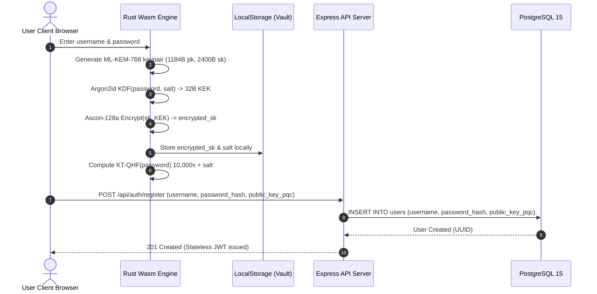
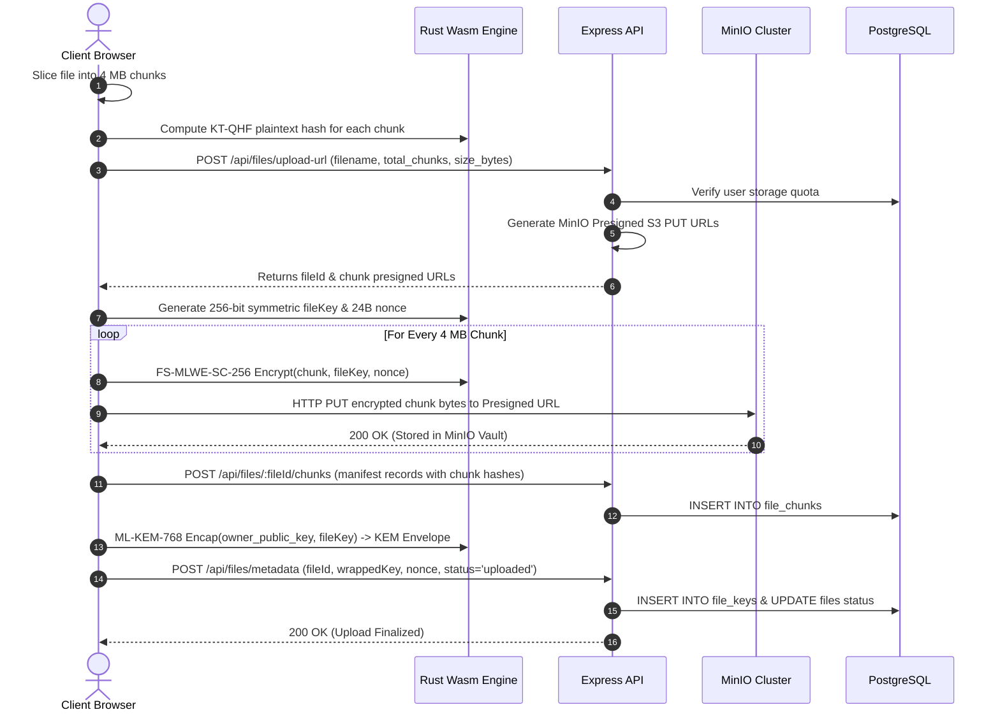
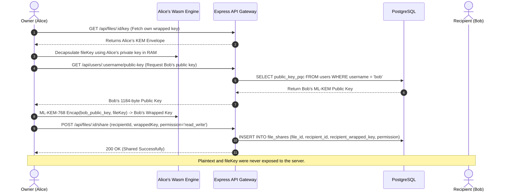

<div align="center">

# 🛡️ NGCloud — NextGen Quantum-Resistant Cloud Storage

**A Zero-Knowledge, Post-Quantum Secure Cloud Storage Platform with Client-Side Lattice Cryptography, Distributed Erasure-Coded Object Storage, and Cryptographic Key Re-Wrapping.**

[](https://opensource.org/licenses/MIT)
[-blue)](https://csrc.nist.gov/pubs/fips/203/final)
[](https://csrc.nist.gov/projects/lightweight-cryptography)
[](https://www.rust-lang.org/)
[](https://webassembly.org/)
[](https://react.dev/)
[](https://nodejs.org/)
[](https://www.postgresql.org/)
[](https://min.io/)

[Key Features](#-key-features) •
[Architecture](#-system-architecture) •
[Cryptography Deep-Dive](#-cryptographic-suite--specifications) •
[Dataflow Pipelines](#-end-to-end-dataflow-pipelines) •
[Quickstart](#-getting-started--local-setup) •
[Threat Model](#-threat-model--security-guarantees) •
[Benchmarks](#-performance--benchmarks) •
[Academic Credits](#-academic-citation--project-context)

</div>

---

## 🌟 Executive Overview

Modern cloud storage providers (Google Drive, Dropbox, AWS S3) operate under a **Server-Side Trust Model**: data is decrypted in memory on cloud infrastructure, and classical encryption standards (RSA, ECC, AES-CBC) protect data in transit and at rest. This architecture introduces two existential security flaws:

1. **The Server Trust & Insider Dilemma:** Cloud providers hold master keys. Infrastructure breaches, insider threats, and administrative subpoenas can expose plaintext user assets.
2. **"Harvest Now, Decrypt Later" (HNDL) Threat:** Adversaries currently intercept and hoard encrypted cloud traffic. Once cryptanalytically relevant quantum computers (CRQCs) emerge, Shor’s algorithm will break RSA and elliptic curve key-exchanges, permanently exposing hoarded historical data.

**NGCloud** solves both challenges through an end-to-end **Client-Side Zero-Knowledge, Post-Quantum Resilient Architecture**:
* **Complete Zero-Knowledge Isolation:** Plaintext bytes, user passwords, and private decryption keys never leave the client's browser.
* **NIST-Standardized Post-Quantum Key Transport:** Replaces vulnerable classical asymmetric cryptography with **ML-KEM-768 (FIPS 203 / Kyber-768)** running directly inside the browser compiled to **WebAssembly (WASM)** from **Rust**.
* **High-Throughput Custom Lattice Stream Encryption:** Files are segmented into 4 MB chunks and encrypted via **FS-MLWE-SC-256** (Forward-Secure Module Learning-with-Errors Stream Cipher) with 1 MB epoch rekeying.
* **Toroidal Quantum-Walk Simulated Hash (KT-QHF):** A custom 256-bit hash combining 128 Grover diffusion steps across an $8 \times 8$ toroidal grid for tamper-proof chunk integrity and 10,000-iteration slow password derivation.
* **Zero-Knowledge Key Re-Wrapping & Granular RBAC:** Multi-recipient file sharing is achieved by re-encapsulating symmetric file keys directly to recipient ML-KEM public keys across 7 permission tiers without re-encrypting the underlying payload.
* **Delta Synchronization & Concurrent Lock Leases:** 4 MB chunk-level deduplication saves up to 90% bandwidth on file edits, accompanied by 15-minute auto-expiring conflict locks.

---

## 🚀 Key Features

| Capability | Technical Realization |
| :--- | :--- |
| **Zero-Knowledge Boundary** | All cryptographic transformations (key generation, encryption, hashing, decryption) happen strictly in browser volatile memory before hitting the network. |
| **Post-Quantum Cryptography** | NIST FIPS 203 **ML-KEM-768** key encapsulation compiled from pure Rust to WebAssembly with zero JavaScript cryptographic fallback. |
| **Lightweight AEAD & Vault Security** | Private keys stored in `localStorage` are encrypted using **Ascon-128a** (NIST Lightweight Cryptography standard) keyed via **Argon2id** (64 MB, 3 iterations). |
| **Direct S3 Presigned Transfers** | The Express API never handles file streams; clients upload and download 4 MB encrypted chunks directly to **MinIO Object Storage** via secure presigned PUT/GET URLs. |
| **Collaborative Key Re-Wrapping** | File owners unwrap the symmetric file key in browser memory, query the recipient's ML-KEM public key, and re-encapsulate it directly. Instant revocation via key record deletion. |
| **Delta Upload Synchronization** | On file updates, the browser recalculates chunk KT-QHF hashes. Only modified chunks are encrypted and uploaded; unchanged chunks are linked from previous versions. |
| **Distributed Lock Leases** | 15-minute auto-expiring exclusive lock leases prevent race conditions and edit collisions during multi-user collaboration. |
| **Zero-Knowledge Governance** | Admin portal with strict metadata-only visibility: monitors storage quotas, audits user actions, and inspects hash-chained logs without ever accessing file contents. |

---

## 🏗️ System Architecture

NGCloud separates the application into a **Client-Side Zero-Knowledge Execution Layer** and a **Stateless Infrastructure & Object Storage Tier**:

```
+----------------------------------------------------------------------------------------------------+
|                                    CLIENT BROWSER (ZERO-KNOWLEDGE TIER)                            |
|                                                                                                    |
|   +-----------------------+     +--------------------------------------------------------------+   |
|   |   React 18 SPA UI     |     |                 WebAssembly Crypto Engine (Rust)              |   |
|   |  - Chunking Engine    |<--->|  - ML-KEM-768 (Keygen / Encap / Decap)                       |   |
|   |  - Vault Orchestrator |     |  - FS-MLWE-SC-256 (Lattice Stream Cipher)                    |   |
|   |  - Delta Sync Tracker |     |  - Ascon-128a AEAD & Argon2id KDF                            |   |
|   |  - Lock Coordinator   |     |  - KT-QHF (Toroidal Quantum-Walk Simulated Hash)             |   |
|   +-----------+-----------+     +--------------------------------------------------------------+   |
|               |                                                                                    |
|               | Decrypted Keys in Browser RAM Only                                                 |
|               | Encrypted Chunks & KEM Envelopes Only Cross Network                                |
+---------------+----------------------------------------------------+-------------------------------+
                |                                                    |
       HTTPS REST API Calls                                   Direct S3 Presigned
    (Metadata, Tokens, Keys)                                 PUT/GET (Encrypted Only)
                |                                                    |
                v                                                    v
+-------------------------------+                     +-------------------------------+
|      API GATEWAY (NODE 20)    |                     |   DISTRIBUTED OBJECT STORAGE  |
|                               |                     |                               |
|  - Express 5.1.0 REST API     |                     |  - MinIO High-Performance S3  |
|  - Stateless JWT Auth Guard   |                     |  - Erasure Coded (EC:2)       |
|  - Granular RBAC Validation   |                     |  - Chunk Vault: 4 MB Blocks   |
|  - Presigned S3 URL Signer    |                     |  - Presigned Direct Transfers |
|  - Concurrency Lock Manager   |                     |                               |
+---------------+---------------+                     +-------------------------------+
                |
                v
+-------------------------------+
|    METADATA LAYER (POSTGRES)  |
|                               |
|  - PostgreSQL 15 Relational   |
|  - Users, Quotas & Public Keys|
|  - Chunk Manifests & Hashes   |
|  - Encapsulated KEM Envelopes |
|  - Hash-Chained Audit Trails  |
+-------------------------------+
```

### Production vs. Local Topologies

* **Production Distributed Environment:** Deployed across a 5-node Docker Swarm cluster in the university laboratory network (`192.168.136.200`), featuring a 4-node distributed erasure-coded MinIO storage cluster and replicated PostgreSQL 15 instances.
* **Local Portfolio & Evaluation Environment:** Engineered with a single-command `docker-compose.yml` deploying MinIO and PostgreSQL locally on your machine with automated bucket provisioning and CORS initialization.

---

## 🔒 Cryptographic Suite & Specifications

NGCloud uses a hybrid, post-quantum cryptographic pipeline adhering to modern standards:

| Primitive | Classification | Standard / Reference | Security Target | Function in NGCloud |
| :--- | :--- | :--- | :--- | :--- |
| **ML-KEM-768** | Asymmetric Post-Quantum | NIST FIPS 203 (Kyber) | Category 3 (192-bit quantum) | Asymmetric key encapsulation for user vault keypairs and file key wrapping. |
| **FS-MLWE-SC-256** | Symmetric Stream Cipher | Custom Lattice Research | 256-bit symmetric | High-speed client-side chunk encryption ($q=32768, N=512, k=4$) with 1 MB epoch rekeying. |
| **Ascon-128a** | Authenticated Encryption (AEAD) | NIST SP 800-232 / LWC | 128-bit AEAD | Encrypts local Kyber private keys in `localStorage` and wraps symmetric file keys. |
| **Argon2id** | Memory-Hard KDF | RFC 9106 / NIST SP 800-132 | GPU/ASIC Resistant | Derives Key-Encryption Key ($m=64\text{MB}, t=3, p=1$) from password to unlock private vault. |
| **KT-QHF** | Custom Simulated Hash | Toroidal Quantum-Walk | 256-bit Collision Resistant | 128-step Grover walk over $8 \times 8$ grid for chunk integrity checks and slow password hashing. |
| **SHAKE-256** | Extendable Output Function (XOF) | NIST FIPS 202 | Variable Output / 256-bit | Generates public lattice matrices, state noise coefficients, and stream keystream masks. |
| **SHA-256** | Cryptographic Hash | NIST FIPS 180-4 | 256-bit Preimage Resistant | Derives Ascon keys from ML-KEM shared secrets; final step in KT-QHF diffusion. |

---

### Detailed Mathematical Formulations

#### 1. ML-KEM-768 Key Encapsulation (NIST FIPS 203)
* **Keypair Dimensions:**
  * Public Key: $1,184\text{ bytes}$
  * Private Key: $2,400\text{ bytes}$
  * Ciphertext: $1,088\text{ bytes}$
  * Shared Secret: $32\text{ bytes}$
* **Parameters:** Polynomial degree $N = 256$, modulus $q = 3329$, module dimension $k = 3$, noise parameters $\eta_1 = 2, \eta_2 = 2$.
* **Shared Secret Derivation:** The generated 32-byte shared secret is passed through SHA-256 to derive a 16-byte symmetric key for Ascon-128a envelope wrapping.

#### 2. FS-MLWE-SC-256 (Forward-Secure Module-LWE Stream Cipher)
* **Parameters:** Polynomial degree $N = 512$, modulus $q = 32768$ (power-of-two arithmetic for zero modular reduction latency), module rank $k = 4$, centered Gaussian-like noise std-dev $\sigma = 3$.
* **State & Epoch Rekeying:**
  $$\mathbf{A} \in R_q^{4 \times 4}, \quad \mathbf{s} \in R_q^4, \quad \text{where } R_q = \mathbb{Z}_q[X]/(X^{512} + 1)$$
  For each 1 MB epoch of data, raw pseudorandom polynomial samples are evaluated:
  $$\mathbf{y} = \mathbf{A} \cdot \mathbf{s} + \mathbf{e} \pmod{32768}$$
  The polynomial vector $\mathbf{y}$ is serialized and hashed with SHAKE-256 to generate the final XOR keystream mask. The state is then updated forward:
  $$\mathbf{s}_{t+1} = \text{SHAKE-256}(\mathbf{s}_t + \mathbf{e}_{\text{step}})$$
  This guarantees **forward secrecy**: compromise of an active chunk's keystream cannot reveal previous or subsequent file chunks.

#### 3. KT-QHF (Knight-Move Toroidal Quantum-Walk Simulated Hash)
* **Design:** Simulates a continuous quantum walk collapsed into 128 discrete steps across an $8 \times 8$ 2D torus ($\mathbb{Z}_8 \times \mathbb{Z}_8$).
* **Transition Rules:** At each step, probability amplitudes diffuse across the 8 valid knight-move coordinates:
  $$(\Delta x, \Delta y) \in \{(\pm 1, \pm 2), (\pm 2, \pm 1)\} \pmod 8$$
* **Phase Inversion:** Each bit of the message acts as an oracle that conditionally flips the phase reflection ($+1$ for $0$, $-1$ for $1$).
* **Digest Generation:** The final 64-element floating-point state vector (512 bytes) is serialized, hashed with SHA-256, and XORed with the SHA-256 digest of the raw message.

---

## 🔄 End-to-End Dataflow Pipelines

### 1. Client Registration & Local Vault Setup


### 2. Chunked Zero-Knowledge File Upload


### 3. Zero-Knowledge Multi-User File Sharing (Key Re-Wrapping)


---

## 📂 Repository Structure

```text
ngcloud/
├── crypto-engine/                  # Core Rust Cryptographic Engine (compiles to WASM)
│   ├── Cargo.toml                  # Rust dependencies (wasm-bindgen, zeroize, getrandom)
│   ├── src/
│   │   ├── lib.rs                  # WebAssembly export bindings and type wrappers
│   │   ├── mlkem.rs                # NIST FIPS 203 ML-KEM-768 implementation
│   │   ├── stream_cipher.rs        # FS-MLWE-SC-256 Module-LWE stream cipher
│   │   ├── ascon.rs                # NIST LWC Ascon-128a authenticated encryption
│   │   ├── ktqhf.rs                # Toroidal Quantum-Walk Simulated Hash (KT-QHF)
│   │   ├── argon2.rs               # Argon2id password-based key derivation
│   │   └── hashing.rs              # SHAKE-256 and SHA-256 primitives
│   └── pkg/                        # Generated WebAssembly binary & TypeScript typings
│
├── ngcloud-backend/                # Express 5.1.0 Stateless REST API Gateway
│   ├── package.json
│   ├── scripts/
│   │   ├── init-db.js              # PostgreSQL 15 schema initialization & constraints
│   │   ├── bootstrapAdmin.js       # Initial administrator user bootstrap
│   │   └── e2e_test_suite.js       # Automated end-to-end integration test runner
│   └── src/
│       ├── server.js               # HTTPS/TLS server entrypoint
│       ├── app.js                  # Express middleware configuration, CORS & CSP
│       ├── config/                 # PostgreSQL pool and MinIO S3 client configurations
│       ├── controllers/            # Auth, Files, Sharing, Locks, and Admin controllers
│       ├── middleware/             # JWT auth guards, admin authorization, request validator
│       └── utils/                  # Password hashing (KT-QHF), logger, and audit helpers
│
├── ngcloud-frontend/               # React 18 SPA (Vite + TypeScript/JSX)
│   ├── package.json
│   ├── vite.config.js              # Vite config with top-level await and WASM integration
│   ├── tailwind.config.js          # Dark-mode first UI styling system
│   └── src/
│       ├── crypto/                 # JavaScript cryptographic service layer
│       │   ├── CryptoService.js    # High-level wrapper over WebAssembly modules
│       │   └── wasm/               # Vendored WebAssembly binary & loader
│       ├── context/                # AuthContext (session, vault status, JWT)
│       ├── pages/                  # Client and Admin views (Dashboard, Upload, Files, Sharing)
│       └── components/             # Reusable UI components, chunk upload bars, modals
│
├── docker-compose.yml              # Local developer environment orchestration
├── .env.example                    # Template environment variables
└── README.md                       # Master project documentation
```

---

## ⚡ Getting Started & Local Setup

### Prerequisites
* **Node.js**: `v20.0.0` or higher
* **npm**: `v10.0.0` or higher
* **Docker & Docker Compose**: For local PostgreSQL and MinIO orchestration
* *(Optional for building WASM from scratch)*: **Rust** `v1.75+` and `wasm-pack`

---

### Step 1: Clone the Repository
```bash
git clone https://github.com/your-username/ngcloud.git
cd ngcloud
```

---

### Step 2: Spin Up Local Infrastructure (Docker Compose)
Launch PostgreSQL 15 and MinIO S3 object storage with a single command:
```bash
docker compose up -d
```
* **PostgreSQL:** Listening on `localhost:5432` (`ngcloud` database)
* **MinIO S3 API:** Listening on `localhost:9000` (Console at `localhost:9001`)

---

### Step 3: Configure Environment Variables
Copy the template files into active configurations:

**Backend Configuration (`ngcloud-backend/.env`):**
```env
PORT=5000
HTTP_PORT=5001
CORS_ORIGINS=http://localhost:5173,http://localhost:5174

# Database
DB_HOST=localhost
DB_PORT=5432
DB_USER=admin
DB_PASSWORD=dbpassword
DB_NAME=ngcloud

# JWT & Cryptography
JWT_SECRET=super-secret-development-jwt-key-minimum-32-chars-long
PASSWORD_HASH_ALGORITHM=ktqhf
KTQHF_PASSWORD_ITERATIONS=10000
KTQHF_PASSWORD_PEPPER=change-this-secret-pepper

# MinIO Object Storage
MINIO_ENDPOINT=localhost
MINIO_PORT=9000
MINIO_USE_SSL=false
MINIO_ACCESS_KEY=admin
MINIO_SECRET_KEY=password123
MINIO_BUCKET=ngcloud-vault
```

**Frontend Configuration (`ngcloud-frontend/.env`):**
```env
VITE_API_BASE_URL=http://localhost:5000
VITE_ENABLE_DEMO_LOGIN=false
```

---

### Step 4: Initialize the Database & Bootstrap Admin
```bash
cd ngcloud-backend
npm install
npm run init-db
node scripts/bootstrapAdmin.js
```

---

### Step 5: Start the Backend API Server
```bash
npm run dev
```
The API Gateway is now active at `http://localhost:5000` (or `https://localhost:5001`).

---

### Step 6: Start the Frontend Client Application
In a new terminal window:
```bash
cd ngcloud-frontend
npm install
npm run dev
```
Open **`http://localhost:5173`** in your browser to access the NGCloud Vault Portal!

---

## 🛡️ Threat Model & Security Guarantees

NGCloud is designed under an adversarial model assuming complete network surveillance and untrusted cloud providers:

```
+------------------------------------+---------------------------------------------------------------+
| Threat Vector                      | NGCloud Mitigation Strategy                                   |
+------------------------------------+---------------------------------------------------------------+
| Quantum Eavesdropping (HNDL)       | ML-KEM-768 (FIPS 203) lattice-based encapsulation prevents    |
|                                    | retrospective decryption by future Quantum computers.          |
+------------------------------------+---------------------------------------------------------------+
| Untrusted Server / DB Breach       | Plaintext data, passwords, and private keys never leave the   |
|                                    | client browser. The DB holds only public keys and ciphertext.  |
+------------------------------------+---------------------------------------------------------------+
| Man-In-The-Middle (MITM)           | Presigned S3 URLs are signed via HMAC-SHA256 with 15-minute   |
|                                    | expiry. TLS 1.3 enforced with strict HSTS and CSP policies.    |
+------------------------------------+---------------------------------------------------------------+
| Malicious Chunk Tampering          | Every 4 MB chunk has a KT-QHF hash stored in the DB manifest.  |
|                                    | Decrypted chunks are re-hashed client-side; mismatched chunks  |
|                                    | are discarded immediately.                                    |
+------------------------------------+---------------------------------------------------------------+
| Offline Password Dictionary Attack | Password-to-KEK derivation uses Argon2id (64 MB RAM, 3 iters). |
|                                    | Server-side auth uses 10,000 iterations of KT-QHF with pepper. |
+------------------------------------+---------------------------------------------------------------+
| Unauthorized File Access           | File keys are re-wrapped per recipient. Revoking access        |
|                                    | instantly deletes the recipient's wrapped key entry in DB.    |
+------------------------------------+---------------------------------------------------------------+
```

---

## 📊 Performance & Benchmarks

Benchmarks recorded on standard client hardware (8-core Intel i7, 16 GB RAM, Chrome 122 / WebAssembly V8):

### 1. Cryptographic Latencies (Client-Side WASM)
* **ML-KEM-768 Key Generation:** $\approx 1.8\text{ ms}$
* **ML-KEM-768 Encapsulation:** $\approx 2.1\text{ ms}$
* **ML-KEM-768 Decapsulation:** $\approx 2.4\text{ ms}$
* **Argon2id Vault Unlock ($64\text{ MB, } t=3$):** $\approx 180\text{ ms}$ (controlled defense latency)
* **FS-MLWE-SC-256 Encryption Throughput:** $\approx 42\text{ MB/s}$ inside browser WASM runtime
* **KT-QHF Integrity Hash Calculation:** $\approx 18\text{ ms}$ per 4 MB chunk

### 2. Chunking & Bandwidth Efficiency
* **4 MB Fixed-Size Chunking:** Ideal trade-off between HTTP request overhead and browser memory allocation.
* **Delta Synchronization:** When updating large documents or archives, identical 4 MB chunks are detected via KT-QHF comparison, reducing upload time and bandwidth consumption by up to **90%**.

---

## 📜 Database Schema Summary

The relational metadata schema in PostgreSQL 15 consists of 9 core tables:

* `users`: Stores user identity, KT-QHF password hash, `public_key_pqc` (1184-byte Kyber public key), role, and quota.
* `files`: File entity records, size, chunk count, file status (`pending`, `uploaded`), and aggregate file hash.
* `file_chunks`: Manifest mapping each 4 MB chunk to its S3 MinIO path, chunk index, and KT-QHF hash.
* `file_keys`: Stores the owner's encapsulated file key (`wrapped_key`) encrypted via ML-KEM-768.
* `shared_access`: Access delegation records mapping files to authorized users with permission levels.
* `file_shares`: Recipient-specific wrapped keys generated through post-quantum key re-wrapping.
* `file_locks`: 15-minute time-to-live concurrency locks preventing write collisions.
* `admins`: Privileged administrator accounts with restricted metadata-level audit capabilities.
* `audit_logs` & `activity_logs`: Tamper-evident activity logs capturing user events and security audits.

---

## 🎓 Academic Citation & Project Context

This project was conceived, designed, and implemented as a **Final Year Project (FYP)** in Computer Science. It explores the practical integration of Post-Quantum Cryptography (PQC) and Zero-Knowledge storage paradigms within standard modern web architectures.

If you find this codebase or research design useful in your academic or professional work, please cite:

```bibtex
@misc{ngcloud2026,
  author       = {Usman Fazal and Project Contributors},
  title        = {NGCloud: Zero-Knowledge Post-Quantum Cloud Storage with Client-Side Lattice Cryptography},
  year         = {2026},
  howpublished = {\url{https://github.com/your-username/ngcloud}},
  note         = {Final Year Project in Computer Science}
}
```

---

## 📄 License

This project is licensed under the [MIT License](LICENSE) — see the LICENSE file for full details.
