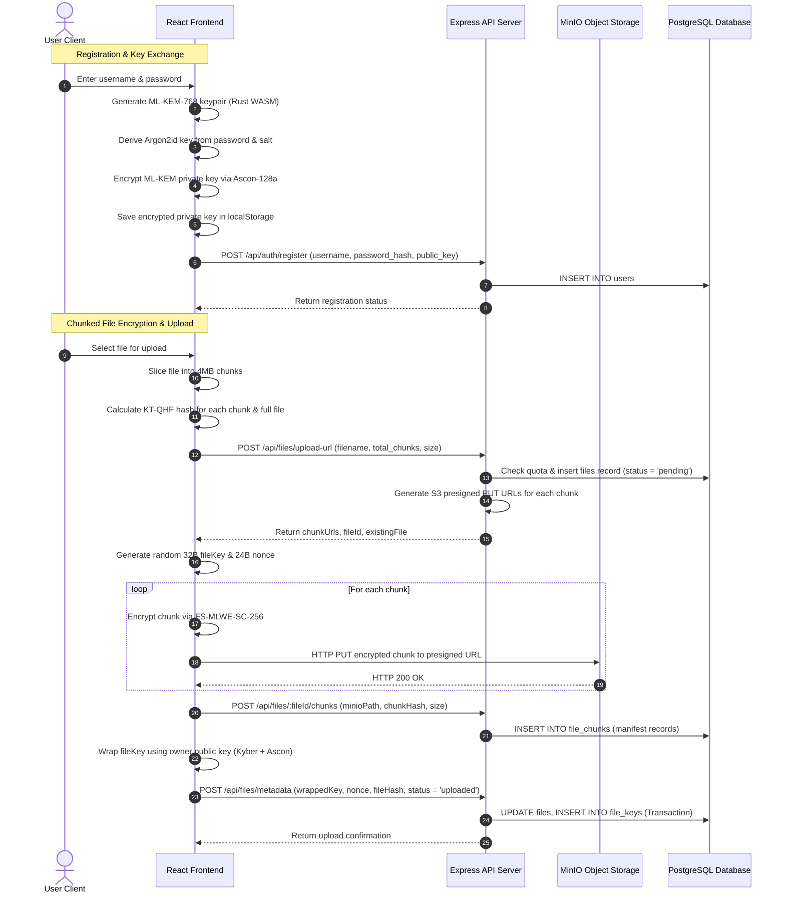
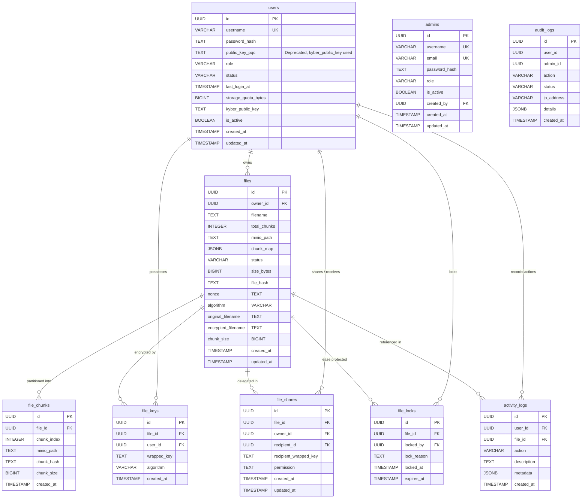
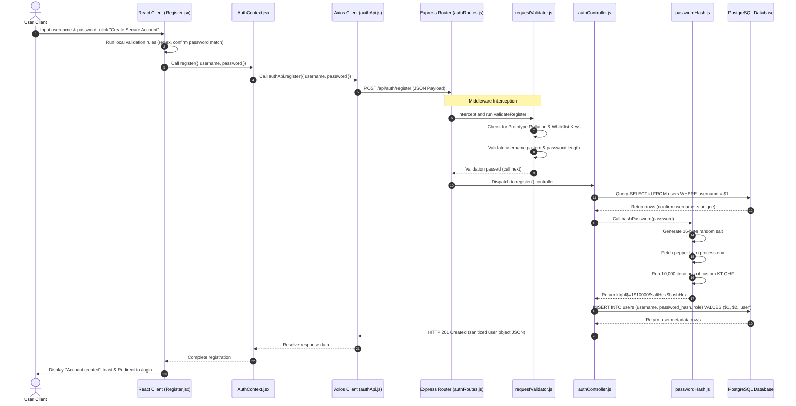
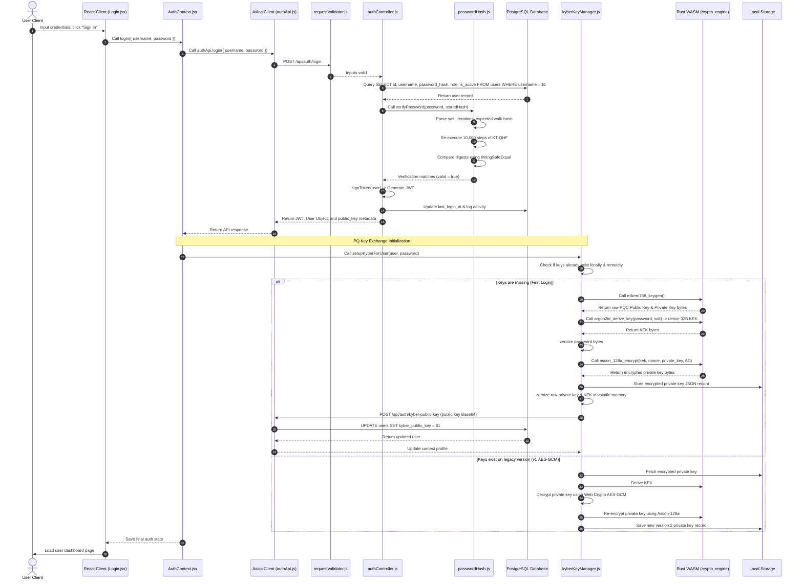
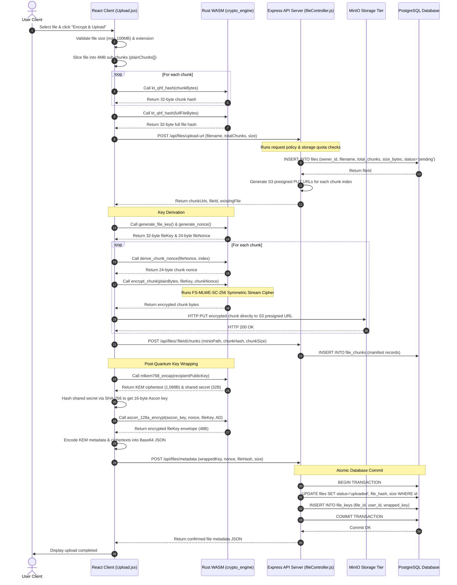
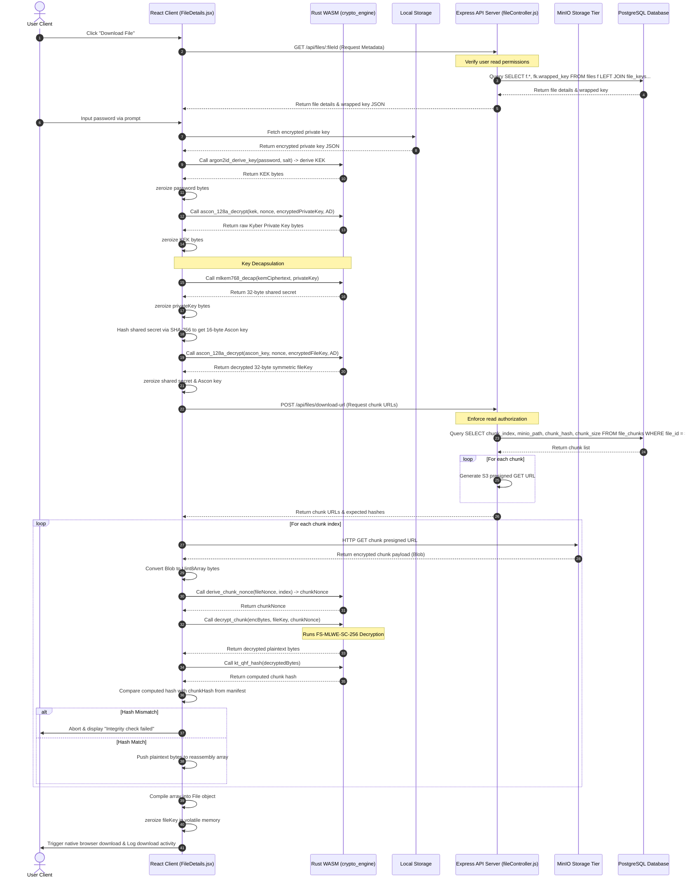
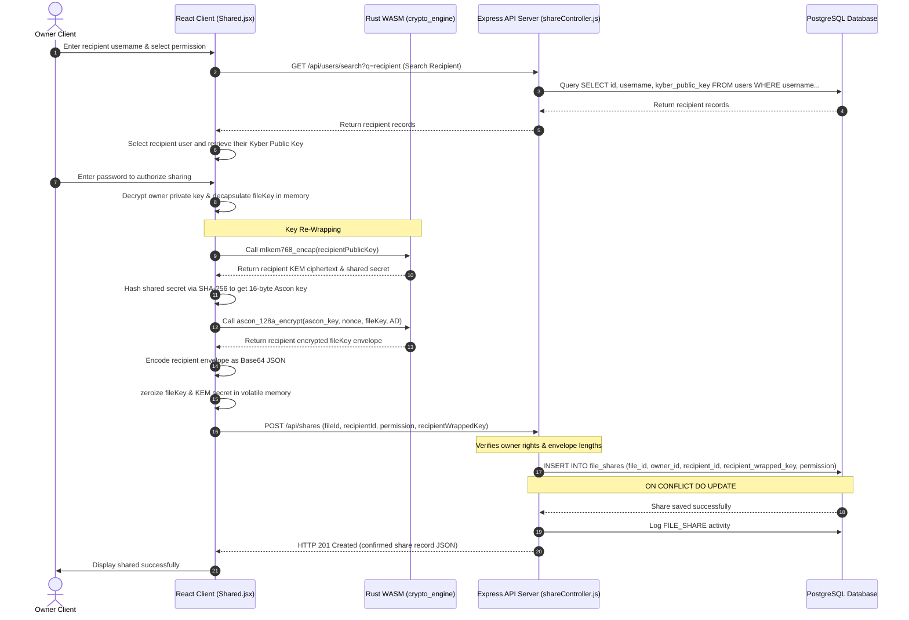
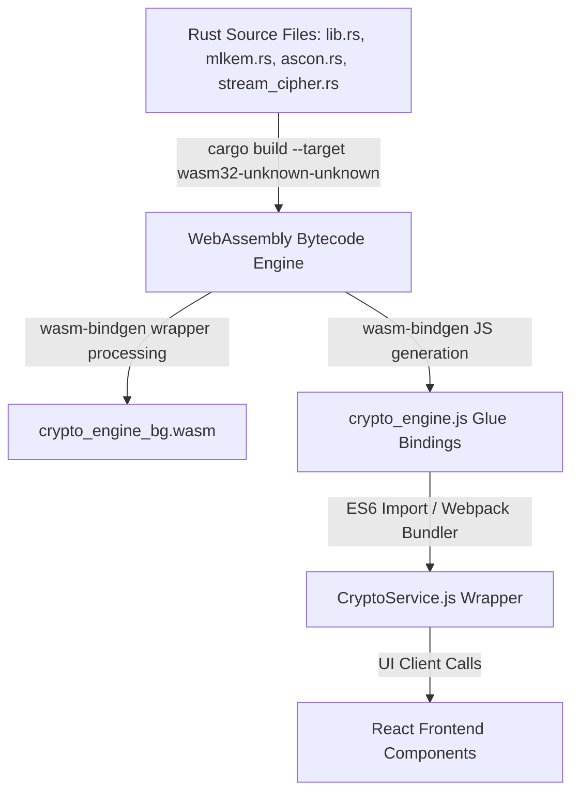
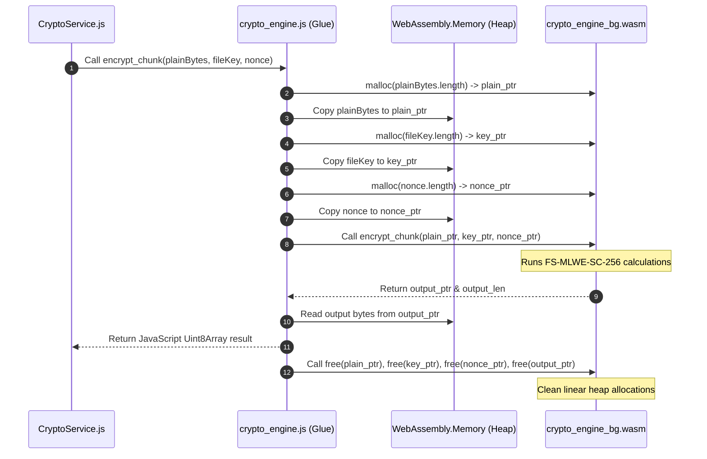
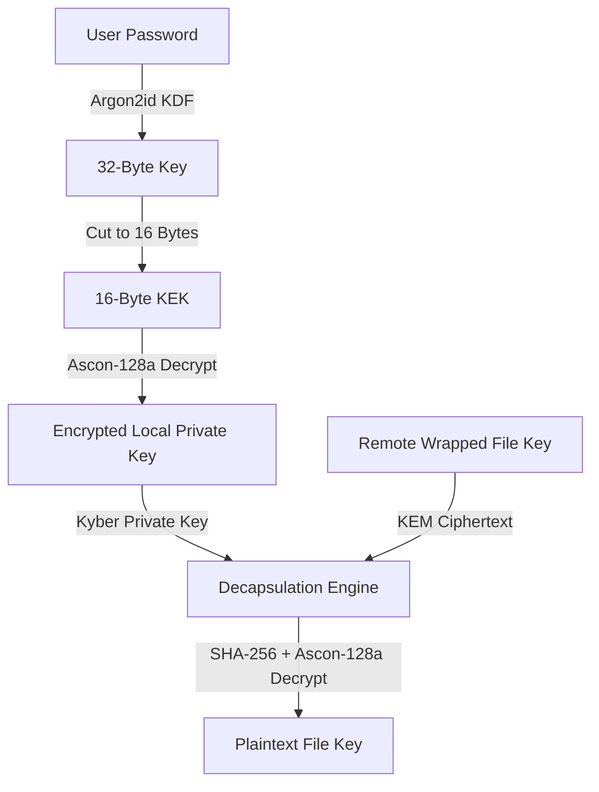

# Technical Implementation & Code Audit Report: NG-Cloud Secure Storage

This document provides an exhaustive, source-code-level audit, reverse-engineering report, and architectural blueprint of the **NG-Cloud (NextGen Cloud)** application. It is structured to provide direct, source-based verification for Chapters 3 (Methodology), 4 (Technical Implementation), and 5 (Results & Evaluation) of a Final Year Project thesis. Every detail is extracted directly from the codebase. Planned but unimplemented features are explicitly highlighted.

---

## PART 1 — PROJECT OVERVIEW

### 1.1 Overall Project Goal
The core objective of NG-Cloud is to implement a secure, **Zero-Knowledge (ZK)** cloud storage web application. It secures files before they leave the client's web browser, protecting data from server-side compromise, storage network breaches, and unauthorized administrator access. Key capabilities include post-quantum cryptographic (PQC) key distribution, custom lattice-based stream encryption, modular file chunking, collaborative lock leases, and granular access delegation.

### 1.2 Problem Statement
Traditional cloud storage services rely on Server-Side Encryption (SSE) or client-side encryption using pre-quantum algorithms (RSA, ECC, AES). This creates major vulnerabilities:
1. **Server Trust Assumption**: In SSE, the storage provider holds the encryption keys, leaving data vulnerable to server compromise, insider threats, and administrative subpoenas.
2. **Quantum Vulnerability**: Pre-quantum public-key cryptography (RSA, ECDH, ECDSA) relies on integer factorization and discrete logarithms, which can be solved in polynomial time by future quantum computers running Shor's algorithm.
3. **Concurrent Write Collisions**: Multi-user shared storage environments lack decentralized, lease-scoped concurrency controls, resulting in overwrites or lost updates during collaborative editing.
4. **Integrity Audits**: Standard cryptographic hashes (SHA-2, SHA-3) do not natively model quantum mechanical properties like walk state space simulation for enhanced diffusion.

### 1.3 Security Objectives
NG-Cloud addresses these problems through the following security targets:
* **Client-Side Zero-Knowledge Boundary**: Plaintext data and raw decryption keys exist *only* in the volatile memory of the client browser. They are never sent to the API backend or stored in the PostgreSQL database.
* **Post-Quantum Hybrid Asymmetric Security**: Key encapsulation and symmetric file key distribution are managed via standard **ML-KEM-768 (Kyber-768)**, combined with lightweight **Ascon-128a** authenticated encryption.
* **Quantum-Walk Integrity Audits**: A custom **Toroidal Quantum-Walk Simulated Hash (KT-QHF)** verifies chunk-level and file-level integrity, as well as providing slow, iterative hashing for account passwords.
* **Lattice-Based Symmetric Encryption**: High-speed, post-quantum client-side stream encryption is handled by a custom Module Learning with Errors cipher (**FS-MLWE-SC-256**).
* **Granular Access Delegation**: Access is shared by re-wrapping file keys under a recipient's Kyber public key. Access levels are restricted to specific permissions (`read`, `write`, `review`, `share`, `read_write`, `read_review`, `full_access`).
* **Concurrency Protection**: Transient 15-minute lease locks on files prevent modification overlaps.

### 1.4 Zero-Knowledge Architecture
The zero-knowledge design follows a strict data flow boundary:

```
[ CLIENT BROWSER VOLATILE MEMORY ]             [ SECURE CHANNEL ]          [ SERVER TIER (API / DB / S3) ]
+------------------------------------+                                     +-------------------------------+
|  Plaintext File Bytes              |                                     |                               |
|  Symmetric fileKey (32 bytes)      |                                     |                               |
|  Kyber Private Key (2400 bytes)    |                                     |                               |
+-----------------+------------------+                                     +-------------------------------+
                  |                                                                        ^
                  | (FS-MLWE-SC-256)                                                       | (Metadata Only)
                  v                                                                        |
+-----------------+------------------+                                     +---------------+---------------+
|  Encrypted Chunks (4MB blocks)     |=========( S3 Presigned PUTs )======>|  MinIO Object Storage Vault   |
|  Wrapped Key (KEM Envelope JSON)   |---------( REST Metadata Post )----->|  PostgreSQL Database          |
+------------------------------------+                                     +-------------------------------+
```

1. **Key Setup**:
   * The user enters a password during registration.
   * On login, the client generates a 768-bit ML-KEM keypair in WebAssembly.
   * The client derives a 16-byte Ascon wrapping key from the password via **Argon2id** (64MB memory, 3 iterations).
   * The Kyber private key (2,400 bytes) is encrypted locally using **Ascon-128a** and stored in the browser's `localStorage`.
   * The Kyber public key (1,184 bytes) is sent to the backend database.
2. **File Upload**:
   * A file is split into 4MB chunks client-side.
   * A random 32-byte symmetric file key and 24-byte nonce are generated in WebAssembly.
   * Chunks are encrypted via `FS-MLWE-SC-256` and uploaded directly to MinIO using S3 presigned URLs.
   * The file key is wrapped (encapsulated) using the recipient's Kyber public key, producing a KEM ciphertext (1,088 bytes) and an Ascon-encrypted file key payload (48 bytes).
   * The wrapped key container is saved in PostgreSQL.
3. **File Decryption**:
   * The client retrieves the wrapped key container.
   * The user enters their password. The client derives the Argon2id key, decrypts the Kyber private key from `localStorage`, and decapsulates the KEM ciphertext to recover the shared secret.
   * The client derives the Ascon key from the secret, decrypts the symmetric file key, downloads the encrypted chunks, decrypts them client-side, checks their KT-QHF hashes, and saves the file.

### 1.5 Research Contribution
NG-Cloud makes four primary technical contributions:
1. **WASM-Accelerated Post-Quantum Hybrid Cryptography**: Compiles Rust-based implementations of ML-KEM-768, Ascon-128a, and Argon2id to WebAssembly for high-performance browser execution.
2. **FS-MLWE-SC-256 Symmetric Stream Encryption**: Implements a custom module learning-with-errors stream cipher using polynomial negacyclic multiplications.
3. **KT-QHF Toroidal Simulated Hashing**: Implements a 256-bit hash algorithm modeled as a classical simulation of 128 Grover-diffusion quantum walk steps over an 8x8 toroidal grid.
4. **Zero-Knowledge Multi-User Delegation**: Implements dynamic file key re-wrapping under recipient public keys, matching granular permission controls enforced via API gateways and database constraints.

### 1.6 System Architecture
The application is structured into four main tiers:
1. **Frontend Client**: React Single Page Application (built with Vite) that manages client-side crypto, chunking, state orchestration (via `AuthContext.jsx`), and UI components.
2. **Backend Gateway**: Node.js and Express REST API that handles routing, request validation (via `requestValidator.js`), user management, presigned S3 URL generation, and logs.
3. **Distributed Object Storage**: A MinIO server that stores the encrypted 4MB file chunks.
4. **Relational Database**: A PostgreSQL database that manages system state, relations, indexes, and logs.

### 1.7 High-Level Workflow Sequence



---

## PART 2 — COMPLETE TECH STACK

This section details every technology used in the NG-Cloud project, including why it was selected, how it compares to alternatives, where it is used, its inner workings, and its integration path.

### 2.1 React (v18.3.1)
* **Why Chosen**: Provides a component-driven architecture and virtual DOM updates, which are essential for rendering real-time upload progress bars and dashboard charts.
* **Better than Alternatives**: Standard MVC frameworks (like Angular or ASP.NET) have higher rendering overhead. React's state management is cleaner for updating progress states across chunked uploads.
* **Where Used**: The entire client interface ([ngcloud-frontend/ngcloud/src](file:///a:/ngcloud%20full%20app/ngcloud-frontend/ngcloud/src)).
* **How it Works**: Component trees handle user interactions, state hooks (`useState`, `useEffect`) manage session state, and `AuthContext.jsx` exposes the authentication status.
* **Communication**: Sends requests to the backend REST API using Axios and interacts with the WASM crypto engine.

### 2.2 Vite (v5.4.11)
* **Why Chosen**: An extremely fast frontend build tool that uses native ES modules.
* **Better than Alternatives**: Webpack requires complex loaders for WASM modules. Vite supports plugins like `vite-plugin-wasm` and `vite-plugin-top-level-await` out of the box.
* **Where Used**: Frontend build configuration ([vite.config.js](file:///a:/ngcloud%20full%20app/ngcloud-frontend/ngcloud/vite.config.js)).
* **How it Works**: Serves files locally during development and bundles assets into static HTML/JS for production.
* **Communication**: Compiles and injects the WebAssembly binary loader into the JavaScript bundle.

### 2.3 Node.js (v20+ runtime)
* **Why Chosen**: Event-driven, non-blocking I/O model that is highly scalable for handling multiple S3 URL generation requests.
* **Better than Alternatives**: Python (Django/Flask) or Java (Spring Boot) have higher memory usage per connection. Node's single-threaded event loop is optimal for API gateway routing.
* **Where Used**: Backend runtime environment.
* **How it Works**: Runs the Express server, coordinates DB pooling, and manages S3 client connections.
* **Communication**: Communicates with PostgreSQL via `pg` socket connections and MinIO via S3 SDK API calls.

### 2.4 Express (v5.1.0)
* **Why Chosen**: A minimalist web framework for Node.js APIs.
* **Better than Alternatives**: NestJS has more architectural overhead than is needed for this API gateway. Express allows quick integration of custom security headers and route guards.
* **Where Used**: Backend web server ([app.js](file:///a:/ngcloud%20full%20app/ngcloud-backend/ngcloud-backend/src/app.js)).
* **How it Works**: Resolves HTTP requests through routes, validates inputs via `requestValidator.js`, and maps routes to controller functions.
* **Communication**: Listens on TCP port 5000 (HTTP/HTTPS) and routes traffic to internal controllers.

### 2.5 PostgreSQL (v15+ server, client `pg` v8.21.0)
* **Why Chosen**: ACID-compliant relational database system. Essential for atomic metadata commits, foreign key cascades, and unique constraints.
* **Better than Alternatives**: MongoDB (NoSQL) does not natively support transactions across multiple tables (e.g., updating files and inserting keys at the same time), which is required to prevent orphaned encrypted files.
* **Where Used**: Backend relational database ([db.js](file:///a:/ngcloud%20full%20app/ngcloud-backend/ngcloud-backend/src/config/db.js)).
* **How it Works**: Manages relational tables, indexes, and constraints. Executes queries using a pooled client connection.
* **Communication**: Receives SQL queries from the backend connection pool via port 5432.

### 2.6 MinIO (v8.0.5 client SDK)
* **Why Chosen**: S3-compatible, high-performance object storage server.
* **Better than Alternatives**: Directly writing chunks to a local filesystem does not support horizontal scaling. MinIO provides built-in clustering, replication, and erasure coding.
* **Where Used**: Backend S3 client ([minioClient.js](file:///a:/ngcloud%20full%20app/ngcloud-backend/ngcloud-backend/src/config/minioClient.js)).
* **How it Works**: Generates temporary, signed S3 URLs (`presignedPutObject`, `presignedGetObject`) so the client can upload chunks directly.
* **Communication**: Backend connects to MinIO on port 9003 to sign URLs, and the frontend uploads chunks directly on port 9003.

### 2.7 Docker & Docker Swarm (Not Implemented)
* **Important**: The codebase **does not implement** Docker, Dockerfiles, or docker-compose.yml files. Infrastructure is run locally via Node processes (`npm run dev`) and standard database instances. Any mentions in administrative statistics (e.g., container listings in `adminController.js`) are simulated metadata responses.

### 2.8 Rust (v1.75+ toolchain)
* **Why Chosen**: Provides safe, low-level memory control and can compile to WebAssembly. This is essential for implementing cryptographic primitives that must run quickly in the browser.
* **Better than Alternatives**: C++ is harder to secure against buffer overflows. JavaScript implementations of these algorithms run much slower.
* **Where Used**: WASM crypto engine ([crypto-engine](file:///a:/ngcloud%20full%20app/crypto-engine)).
* **How it Works**: Contains implementations of ML-KEM, Ascon-128a, Argon2id, and the custom ciphers, compiled to wasm.
* **Communication**: Exposes functions to JS via `wasm_bindgen` bindings.

### 2.9 WebAssembly (WASM)
* **Why Chosen**: Near-native execution speed inside web browsers.
* **Better than Alternatives**: Standard JS runs inside an interpreted sandbox, which is too slow for complex cryptographic operations. WASM provides predictable performance.
* **Where Used**: Frontend WASM binary wrapper ([crypto-engine/target](file:///a:/ngcloud%20full%20app/crypto-engine/target)).
* **How it Works**: The compiled WASM binary is loaded into the browser context on app startup.
* **Communication**: Executed by `CryptoService.js` through JS function wrapper calls.

### 2.10 CryptoService
* **Why Chosen**: Provides a unified interface in the frontend for all cryptographic operations.
* **Better than Alternatives**: Distributing cryptographic logic across multiple components makes it hard to maintain. A single service enforces standard patterns like zeroing out memory.
* **Where Used**: Frontend library ([CryptoService.js](file:///a:/ngcloud%20full%20app/ngcloud-frontend/ngcloud/src/crypto/CryptoService.js)).
* **How it Works**: Wraps WASM exports, converts data formats (base64, byte arrays), and securely wipes sensitive memory buffers using the `zeroize` helper.
* **Communication**: Invoked by frontend pages (`Upload.jsx`, `FileDetails.jsx`) and delegates calls to the WASM module.

### 2.11 REST APIs
* **Why Chosen**: Stateless communication model that is easy to secure with JWTs.
* **Better than Alternatives**: GraphQL has more query validation overhead. WebSockets are unnecessary for file upload metadata commits.
* **Where Used**: Communication layer between client and server.
* **How it Works**: Uses standard HTTP verbs (`GET`, `POST`, `PUT`, `DELETE`) with JSON payloads.
* **Communication**: Handled by Axios in the frontend, routed to Express handlers in the backend.

### 2.12 JWT (JSON Web Tokens)
* **Why Chosen**: Stateless authentication format. The server does not need to store session states in memory.
* **Better than Alternatives**: Session cookies require state storage (like Redis), which increases server overhead.
* **Where Used**: API authorization middleware ([authVerify.js](file:///a:/ngcloud%20full%20app/ngcloud-backend/ngcloud-backend/src/middleware/authVerify.js)).
* **How it Works**: The server signs a payload containing the user's ID and role using `jsonwebtoken`. The client attaches this token in the `Authorization: Bearer <token>` header for subsequent requests.
* **Communication**: Signed on login, verified by middlewares, and decoded to extract user context.

### 2.13 HTTPS / TLS
* **Why Chosen**: Encrypts traffic in transit, preventing MITM attacks and eavesdropping.
* **Better than Alternatives**: HTTP sends traffic in plaintext, exposing authorization headers and encrypted chunks to network sniffing.
* **Where Used**: Transport security layer ([server.js](file:///a:/ngcloud%20full%20app/ngcloud-backend/ngcloud-backend/src/server.js)).
* **How it Works**: The server uses Node's `https` module to listen for secure connections using SSL/TLS certificates (e.g. self-signed key/cert files).
* **Communication**: Secures all client-server communication channels.

### 2.14 Argon2id
* **Why Chosen**: A memory-hard key derivation function that is resistant to GPU-based brute-force attacks.
* **Better than Alternatives**: PBKDF2 and bcrypt are vulnerable to GPU/ASIC acceleration. Argon2id provides better protection for key derivation.
* **Where Used**: WebAssembly key derivation ([crypto-engine/src/argon2.rs](file:///a:/ngcloud%20full%20app/crypto-engine/src/argon2.rs)).
* **How it Works**: Derives a 32-byte key from a password and salt using parameters: memory = 64MB, iterations = 3, parallelism = 1.
* **Communication**: Used client-side to derive symmetric keys for encrypting the Kyber private key.

### 2.15 ML-KEM (Kyber-768)
* **Why Chosen**: NIST-approved post-quantum key encapsulation standard, based on the hardness of module learning-with-errors problems.
* **Better than Alternatives**: RSA-4096 and ECDH are vulnerable to quantum decryption. Kyber-768 provides 128 bits of post-quantum security with small keys.
* **Where Used**: WASM key management ([crypto-engine/src/mlkem.rs](file:///a:/ngcloud%20full%20app/crypto-engine/src/mlkem.rs)).
* **How it Works**: Exposes keypair generation, encapsulation (wrapping a shared secret), and decapsulation (unwrapping the secret).
* **Communication**: Negotiates the shared secret used to encrypt the symmetric file key.

### 2.16 Ascon-128a
* **Why Chosen**: NIST-standardized lightweight authenticated encryption (AEAD) cipher.
* **Better than Alternatives**: AES-GCM runs slower on devices without hardware AES acceleration. Ascon-128a is fast and provides authenticated encryption.
* **Where Used**: WASM key wrapping ([crypto-engine/src/ascon.rs](file:///a:/ngcloud%20full%20app/crypto-engine/src/ascon.rs)).
* **How it Works**: Uses 16-byte keys and nonces to process data using 12-round and 8-round permutations on a 320-bit state.
* **Communication**: Encrypts the Kyber private key for local storage and encrypts the symmetric file key.

### 2.17 SHA3-256 (SHAKE-256)
* **Why Chosen**: Secure hash algorithm family that supports variable-length output (Extendable-Output Function / XOF).
* **Better than Alternatives**: SHA-256 has a fixed output length. SHAKE-256 can generate arbitrary lengths of pseudorandom bytes.
* **Where Used**: WASM cryptographic expansions ([crypto-engine/src/hashing.rs](file:///a:/ngcloud%20full%20app/crypto-engine/src/hashing.rs)).
* **How it Works**: Reads input bytes and generates an output stream of the requested length.
* **Communication**: Used by the stream cipher to generate public matrices, state noise, and keystream masks.

### 2.18 KT-QHF (Toroidal Quantum-Walk Simulated Hash)
* **Why Chosen**: A custom 256-bit hash algorithm designed to verify file integrity and secure password hashes.
* **Better than Alternatives**: Standard SHA-256 does not model the state space of a quantum walk, which provides high diffusion.
* **Where Used**: Client-side hash checks ([ktqhf.js](file:///a:/ngcloud%20full%20app/ngcloud-frontend/ngcloud/src/crypto/ktqhf.js)) and backend password hashing ([passwordHash.js](file:///a:/ngcloud%20full%20app/ngcloud-backend/ngcloud-backend/src/utils/passwordHash.js)).
* **How it Works**:
  1. Computes double SHA-256 hashes of the input to generate a 64-byte seed.
  2. Initializes a state array of 64 float values, normalized to sum to 1.
  3. Translates the message into bits.
  4. Runs 128 simulation steps on an 8x8 toroidal grid. In each step, the state at each index is distributed among its 8 knight-move neighbors, and a phase reflection (+1 or -1) is applied based on the current message bit.
  5. Inject seed entropy every 16 steps.
  6. Serializes the final state into 512 bytes, hashes it via SHA-256, and XORs the result with the message's SHA-256 hash to produce the 32-byte output.
* **Communication**: Verifies chunk data integrity on upload/download and hashes passwords for database storage.

### 2.19 FS-MLWE-SC-256
* **Why Chosen**: A custom post-quantum symmetric stream cipher based on Module Learning with Errors (MLWE).
* **Better than Alternatives**: Standard stream ciphers like ChaCha20 do not rely on lattice-based mathematics, which are harder to break using quantum algorithms.
* **Where Used**: Symmetric chunk encryption ([stream_cipher.rs](file:///a:/ngcloud%20full%20app/crypto-engine/src/stream_cipher.rs)).
* **How it Works**:
  * Modulus $q = 32768$, polynomial degree $N = 512$, module dimensions $k = 4$, standard deviation $\sigma = 3$.
  * Generates a public matrix $A$ ($k \times k$ polynomials) and initial state vector $s$ ($k$ polynomials) from the file key and nonce.
  * For each 1MB sub-chunk (epoch), it computes the raw keystream: $y = A \cdot s + e \pmod q$, where $e$ is centered noise sampled from SHAKE-256.
  * Serializes $y$ and hashes it via SHAKE-256 to create a keystream mask, which is XOR-folded with the plaintext.
  * Updates the state vector recursively: $s_{next} = \text{Shake256}(s_{curr} + e_{state}, \dots)$.
* **Communication**: Used by the client to encrypt and decrypt file chunks.

### 2.20 Browser Security Hardening
The API gateway enforces strict security policies on all HTTP responses:
* **Security Headers**:
  * `X-Content-Type-Options: nosniff`: Prevents the browser from MIME-sniffing responses away from the declared content-type.
  * `X-Frame-Options: DENY`: Prevents Clickjacking by blocking the page from being rendered inside an iframe.
  * `Referrer-Policy: no-referrer`: Prevents leaking URL paths in referrer headers during navigation.
  * `Permissions-Policy`: Blocks access to hardware APIs (camera, microphone, geolocation, usb, etc.).
* **Content Security Policy (CSP)**: Enforces `default-src 'none'; frame-ancestors 'none';` to block unauthorized script execution and script injection.
* **Strict Transport Security (HSTS)**: Sends `max-age=31536000; includeSubDomains; preload` if HTTPS is enabled, forcing the browser to load the site only over secure connections.

---

## PART 3 — DIRECTORY STRUCTURE

### 3.1 Major Folders
* **`crypto-engine/`**: The Rust-based cryptographic engine. Contains the WASM definitions, PQC primitives (ML-KEM, Ascon-128a, Argon2id), the custom ciphers, and formatting utilities.
* **`ngcloud-backend/`**: The Express API server. Contains routes, controllers, database pooling configurations, validation schemas, and logging utilities.
* **`ngcloud-frontend/`**: The React/Vite web client. Contains page layouts, UI views, state hooks, and API request services.

### 3.2 File-by-File Breakdown

#### 3.2.1 Crypto Engine (Rust)
* **[lib.rs](file:///a:/ngcloud%20full%20app/crypto-engine/src/lib.rs)**:
  * *Purpose*: Exposes WebAssembly bindings.
  * *Responsibilities*: Declares binding interfaces for the keypair structures, decapsulation structs, and cryptographic functions.
  * *Functions*: `generate_file_key()`, `generate_nonce()`, `derive_chunk_nonce()`, `encrypt_chunk()`, `decrypt_chunk()`, `kt_qhf_hash()`, `ascon_128a_encrypt()`, `ascon_128a_decrypt()`, `argon2id_derive_key()`, `mlkem768_keygen()`, `mlkem768_encap()`, `mlkem768_decap()`.
  * *Calls*: `utils.rs`, `random.rs`, `hashing.rs`, `argon2.rs`, `ascon.rs`, `mlkem.rs`, `stream_cipher.rs`, `ktqhf.rs`.
* **[argon2.rs](file:///a:/ngcloud%20full%20app/crypto-engine/src/argon2.rs)**:
  * *Purpose*: Password-based key derivation.
  * *Responsibilities*: Configures Argon2id parameters and derives symmetric keys.
  * *Functions*: `argon2id_derive_key(password, salt)`.
  * *Called by*: `lib.rs`.
* **[ascon.rs](file:///a:/ngcloud%20full%20app/crypto-engine/src/ascon.rs)**:
  * *Purpose*: Lightweight authenticated encryption.
  * *Responsibilities*: Implements Ascon-128a AEAD encryption and decryption.
  * *Functions*: `ascon_128a_encrypt(key, nonce, plaintext, ad)`, `ascon_128a_decrypt(key, nonce, ciphertext, ad)`.
  * *Called by*: `lib.rs`.
* **[hashing.rs](file:///a:/ngcloud%20full%20app/crypto-engine/src/hashing.rs)**:
  * *Purpose*: Cryptographic hashing utilities.
  * *Responsibilities*: Implements SHA-256 and SHAKE-256 variable-length hashing.
  * *Functions*: `sha256(data)`, `shake256(data, out_len)`.
  * *Called by*: `ktqhf.rs`, `stream_cipher.rs`.
* **[ktqhf.rs](file:///a:/ngcloud%20full%20app/crypto-engine/src/ktqhf.rs)**:
  * *Purpose*: Toroidal quantum-walk simulated hash.
  * *Responsibilities*: Runs the 128-step Grover diffusion quantum-walk simulation.
  * *Functions*: `kt_qhf_hash(message)`, `get_neighbors(idx)`.
  * *Called by*: `lib.rs`.
* **[mlkem.rs](file:///a:/ngcloud%20full%20app/crypto-engine/src/mlkem.rs)**:
  * *Purpose*: Post-quantum asymmetric key encapsulation.
  * *Responsibilities*: Generates ML-KEM-768 key pairs and runs encapsulation/decapsulation.
  * *Functions*: `mlkem768_keygen()`, `mlkem768_encap(public_key)`, `mlkem768_decap(ciphertext, private_key)`.
  * *Called by*: `lib.rs`.
* **[random.rs](file:///a:/ngcloud%20full%20app/crypto-engine/src/random.rs)**:
  * *Purpose*: Random number generation.
  * *Responsibilities*: Uses getrandom to retrieve secure random bytes.
  * *Functions*: `generate_random_bytes(len)`.
  * *Called by*: `lib.rs`.
* **[stream_cipher.rs](file:///a:/ngcloud%20full%20app/crypto-engine/src/stream_cipher.rs)**:
  * *Purpose*: Custom lattice-based symmetric encryption.
  * *Responsibilities*: Implements the FS-MLWE-SC-256 cipher.
  * *Functions*: `encrypt_chunk(plain, key, nonce)`, `decrypt_chunk(cipher, key, nonce)`, `derive_chunk_nonce(file_nonce, index)`, `update_state(state, key, nonce, epoch)`.
  * *Called by*: `lib.rs`.
* **[utils.rs](file:///a:/ngcloud%20full%20app/crypto-engine/src/utils.rs)**:
  * *Purpose*: Format parsing utilities.
  * *Responsibilities*: Handles base64, hex, and byte concatenation.
  * *Functions*: `bytes_to_base64(bytes)`, `base64_to_bytes(base64)`, `concat_bytes(arrays)`.
  * *Called by*: `lib.rs`.

#### 3.2.2 Backend API (Node/Express)
* **[server.js](file:///a:/ngcloud%20full%20app/ngcloud-backend/ngcloud-backend/src/server.js)**:
  * *Purpose*: Starts the server application.
  * *Responsibilities*: Loads environment variables, connects to the DB, checks S3 connectivity, bootstraps the default administrator, and listens for HTTPS traffic.
  * *Calls*: `app.js`, `config/minioClient.js`, `scripts/bootstrapAdmin.js`.
* **[app.js](file:///a:/ngcloud%20full%20app/ngcloud-backend/ngcloud-backend/src/app.js)**:
  * *Purpose*: Configures Express middlewares and routing.
  * *Responsibilities*: Configures CORS origins, JSON parsing limits, HTTPS redirects, and security headers (CSP, HSTS).
  * *Calls*: `routes/` (auth, files, admin, users, shares, policies, activity).
* **[config/db.js](file:///a:/ngcloud%20full%20app/ngcloud-backend/ngcloud-backend/src/config/db.js)**:
  * *Purpose*: Configures the PostgreSQL connection.
  * *Responsibilities*: Creates a connection pool with timeout controls.
  * *Called by*: Routes, controllers, and scripts.
* **[config/minioClient.js](file:///a:/ngcloud%20full%20app/ngcloud-backend/ngcloud-backend/src/config/minioClient.js)**:
  * *Purpose*: Configures the MinIO S3 storage integration.
  * *Responsibilities*: Manages bucket existence checks, bucket creation, S3 error handling, and connection checks.
  * *Called by*: `server.js`, `controllers/fileController.js`, `controllers/adminController.js`.
* **[middleware/authVerify.js](file:///a:/ngcloud%20full%20app/ngcloud-backend/ngcloud-backend/src/middleware/authVerify.js)**:
  * *Purpose*: Validates user JSON Web Tokens.
  * *Responsibilities*: Decodes the `Authorization: Bearer` token to verify requests.
  * *Called by*: User routes.
* **[middleware/adminAuthMiddleware.js](file:///a:/ngcloud%20full%20app/ngcloud-backend/ngcloud-backend/src/middleware/adminAuthMiddleware.js)**:
  * *Purpose*: Validates administrator JWTs.
  * *Responsibilities*: Checks the DB to verify that the administrator is active.
  * *Called by*: Admin routes.
* **[middleware/requestValidator.js](file:///a:/ngcloud%20full%20app/ngcloud-backend/ngcloud-backend/src/middleware/requestValidator.js)**:
  * *Purpose*: Validates request data.
  * *Responsibilities*: Checks for prototype pollution, validates filename lengths (max 180 chars), checks extensions (blocking double extensions), and verifies KEM keys.
  * *Called by*: Routes.
* **[controllers/authController.js](file:///a:/ngcloud%20full%20app/ngcloud-backend/ngcloud-backend/src/controllers/authController.js)**:
  * *Purpose*: Manages user authentication.
  * *Responsibilities*: Handles registration, login, profile updates, PQC public key storage, and session logging.
  * *Calls*: `config/db.js`, `utils/passwordHash.js`, `services/activityLogger.js`.
* **[controllers/fileController.js](file:///a:/ngcloud%20full%20app/ngcloud-backend/ngcloud-backend/src/controllers/fileController.js)**:
  * *Purpose*: Manages S3 URL generation, chunk manifests, metadata commits, and file locks.
  * *Responsibilities*: Checks user quotas, locks files for editing, writes chunk lists, and saves wrapped file keys.
  * *Calls*: `config/db.js`, `config/minioClient.js`, `utils/permissions.js`, `utils/filePolicy.js`.
* **[controllers/shareController.js](file:///a:/ngcloud%20full%20app/ngcloud-backend/ngcloud-backend/src/controllers/shareController.js)**:
  * *Purpose*: Manages file sharing.
  * *Responsibilities*: Shares files, revokes access, and batch-shares files to up to 5 recipients in a transaction.
  * *Calls*: `config/db.js`, `utils/permissions.js`.
* **[controllers/adminController.js](file:///a:/ngcloud%20full%20app/ngcloud-backend/ngcloud-backend/src/controllers/adminController.js)**:
  * *Purpose*: Manages administrator settings.
  * *Responsibilities*: Aggregates statistics, lists files, changes user storage quotas, and manages account status.
  * *Calls*: `config/db.js`, `config/minioClient.js`.
* **[utils/passwordHash.js](file:///a:/ngcloud%20full%20app/ngcloud-backend/ngcloud-backend/src/utils/passwordHash.js)**:
  * *Purpose*: Iterative password hashing.
  * *Responsibilities*: Salted iterative password hashing using `ktqhf.js`. Supports migrating legacy bcrypt passwords to the newer format on successful login.
  * *Calls*: `utils/ktqhf.js`.
* **[utils/permissions.js](file:///a:/ngcloud%20full%20app/ngcloud-backend/ngcloud-backend/src/utils/permissions.js)**:
  * *Purpose*: Permission hierarchy evaluation.
  * *Responsibilities*: Checks authorization states (`read`, `write`, `review`, `share`).
  * *Called by*: Controllers.
* **[services/activityLogger.js](file:///a:/ngcloud%20full%20app/ngcloud-backend/ngcloud-backend/src/services/activityLogger.js)**:
  * *Purpose*: Writes logs to the database.
  * *Responsibilities*: Saves log records without blocking requests.
  * *Called by*: Controllers and middleware.

#### 3.2.3 Frontend Client (React)
* **[main.jsx](file:///a:/ngcloud%20full%20app/ngcloud-frontend/ngcloud/src/main.jsx)**:
  * *Purpose*: Application entry point.
  * *Responsibilities*: Renders the component tree and binds the routing wrapper.
  * *Calls*: `App.jsx`.
* **[App.jsx](file:///a:/ngcloud%20full%20app/ngcloud-frontend/ngcloud/src/App.jsx)**:
  * *Purpose*: Roots the application layouts.
  * *Responsibilities*: Configures state providers and wraps routers.
  * *Calls*: `context/AuthContext.jsx`, `router/index.jsx`.
* **[context/AuthContext.jsx](file:///a:/ngcloud%20full%20app/ngcloud-frontend/ngcloud/src/context/AuthContext.jsx)**:
  * *Purpose*: Manages user sessions.
  * *Responsibilities*: Handles logins, registrations, and logouts. Automatically generates Kyber keypairs on login if keys are missing.
  * *Calls*: `api/authApi.js`, `crypto/kyberKeyManager.js`.
* **[crypto/CryptoService.js](file:///a:/ngcloud%20full%20app/ngcloud-frontend/ngcloud/src/crypto/CryptoService.js)**:
  * *Purpose*: Interfaces JavaScript with the WebAssembly module.
  * *Responsibilities*: Initializes the WASM bundle, manages Base64 conversions, and zeros out volatile memory arrays.
  * *Calls*: `crypto/wasm/crypto_engine.js`.
* **[crypto/fsmlweCipher.js](file:///a:/ngcloud%20full%20app/ngcloud-frontend/ngcloud/src/crypto/fsmlweCipher.js)**:
  * *Purpose*: Manages symmetric file encryption.
  * *Responsibilities*: Handles file chunk encryption and decryption.
  * *Calls*: `CryptoService.js`.
* **[crypto/ktqhf.js](file:///a:/ngcloud%20full%20app/ngcloud-frontend/ngcloud/src/crypto/ktqhf.js)**:
  * *Purpose*: Client-side integrity checks.
  * *Responsibilities*: Generates hex strings from chunk hashes.
  * *Calls*: `CryptoService.js`.
* **[crypto/kyberKeyManager.js](file:///a:/ngcloud%20full%20app/ngcloud-frontend/ngcloud/src/crypto/kyberKeyManager.js)**:
  * *Purpose*: Manages Kyber keypairs.
  * *Responsibilities*: Encrypts the private key with Ascon-128a (derived from the password via Argon2id) and manages key wrapping.
  * *Calls*: `CryptoService.js`.
* **[pages/client/Upload.jsx](file:///a:/ngcloud%20full%20app/ngcloud-frontend/ngcloud/src/pages/client/Upload.jsx)**:
  * *Purpose*: File upload page.
  * *Responsibilities*: Slices files into 4MB chunks, computes hashes, encrypts chunks locally, and sends metadata.
  * *Calls*: `crypto/fsmlweCipher.js`, `crypto/kyberKeyManager.js`, `crypto/ktqhf.js`, `api/filesApi.js`.
* **[pages/client/FileDetails.jsx](file:///a:/ngcloud%20full%20app/ngcloud-frontend/ngcloud/src/pages/client/FileDetails.jsx)**:
  * *Purpose*: File details page.
  * *Responsibilities*: Decrypts private keys, decapsulates wrapped file keys, downloads chunks from MinIO, decrypts chunks, and reassembles files.
  * *Calls*: `crypto/fsmlweCipher.js`, `crypto/kyberKeyManager.js`, `crypto/ktqhf.js`, `api/filesApi.js`.
* **[pages/client/Shared.jsx](file:///a:/ngcloud%20full%20app/ngcloud-frontend/ngcloud/src/pages/client/Shared.jsx)**:
  * *Purpose*: File sharing page.
  * *Responsibilities*: Decrypts the owner's file key, re-wraps it using the recipient's Kyber public key, and sends it to the server.
  * *Calls*: `api/sharesApi.js`, `crypto/kyberKeyManager.js`.

### 3.3 Module Dependency Map

```
+---------------------------------------------------------------------------------+
|                                 CLIENT BROWSER                                  |
|                                                                                 |
|   +-----------------------+              +----------------------------------+   |
|   |    React UI Pages     |------------->|        AuthContext.jsx           |   |
|   | (Upload, Files, etc.) |              |   (Manages JWT & Session Keys)   |   |
|   +-----------------------+              +----------------------------------+   |
|               |                                           |                     |
|               v                                           v                     |
|   +-----------------------+              +----------------------------------+   |
|   |      API Clients      |              |       kyberKeyManager.js         |   |
|   |  (filesApi, authApi)  |              |   (Local Private Key Encryption) |   |
|   +-----------------------+              +----------------------------------+   |
|               |                                           |                     |
|               |                                           v                     |
|               |                          +----------------------------------+   |
|               |------------------------->|        CryptoService.js          |   |
|               |                          |    (WebAssembly Glue Wrapper)    |   |
|               |                          +----------------------------------+   |
|               |                                           |                     |
|               v                                           v                     |
|   +-----------------------+              +----------------------------------+   |
|   |    fsmlweCipher.js    |------------->|      WASM binary loading container|   |
|   | (Lattice Encryption)  |              |  (argon2, ascon, mlkem, cipher)  |   |
|   +-----------------------+              +----------------------------------+   |
|               |                                                                 |
|               v                                                                 |
|   +-----------------------+                                                     |
|   |       ktqhf.js        |                                                     |
|   | (Toroidal 8x8 Hash)   |                                                     |
|   +-----------------------+                                                     |
+---------------+-----------------------------------------------------------------+
                |
                |  (Secure TLS Communication)
                |
                +-------------------------------------------------+
                |                                                 |
                | (S3 Presigned URLs)                             | (HTTPS REST Requests)
                v                                                 v
  +---------------------------+                     +---------------------------+
  |    Distributed Storage    |                     |    Backend API Server     |
  |  (MinIO S3 Object Store)  |                     |        (Express)          |
  +---------------------------+                     +---------------------------+
                                                                  |
                                                                  v
                                                    +---------------------------+
                                                    |     authVerify.js /       |
                                                    |   adminAuthMiddleware     |
                                                    |    (JWT Authenticator)    |
                                                    +---------------------------+
                                                                  |
                                                                  v
                                                    +---------------------------+
                                                    |      API Controllers      |
                                                    | (fileController, sharing) |
                                                    +---------------------------+
                                                                  |
                                                                  +-----------------------+
                                                                  |                       |
                                                                  v                       v
                                                    +---------------------------+   +-----------+
                                                    |      passwordHash.js      |   | minio.js  |
                                                    |   (Iterative KT-QHF)      |   | (S3 SDK)  |
                                                    +---------------------------+   +-----------+
                                                                  |
                                                                  v
                                                    +---------------------------+
                                                    |    PostgreSQL Database    |
                                                    |    (Relational Schemas)   |
                                                    +---------------------------+
```

---

## PART 4 — DATABASE DESIGN

This section details the PostgreSQL schema configured by the database bootstrapper ([init-db.js](file:///a:/ngcloud%20full%20app/ngcloud-backend/ngcloud-backend/scripts/init-db.js)).

### 4.1 Relational Schema Map



### 4.2 Table Definitions

#### 4.2.1 Table: `users`
* **Purpose**: Manages system users, storage allocations, status flags, and post-quantum keys.
* **Columns**:
  * `id`: `UUID` (Primary Key, Default: `gen_random_uuid()`).
  * `username`: `VARCHAR(50)` (Unique, Not Null).
  * `password_hash`: `TEXT` (Not Null). Stored as: `ktqhf$v1$iterations$saltHex$hashHex`.
  * `public_key_pqc`: `TEXT` (Nullable). Legacy field.
  * `kyber_public_key`: `TEXT` (Nullable). Stored as a Base64-encoded string of the Kyber public key (1,184 bytes).
  * `role`: `VARCHAR(20)` (Not Null, Default: `'user'`).
  * `status`: `VARCHAR(20)` (Default: `'active'`). States: `'active'`, `'disabled'`, `'locked'`, `'deleted'`.
  * `is_active`: `BOOLEAN` (Default: `true`). Used by auth checks.
  * `last_login_at`: `TIMESTAMP` (Nullable).
  * `storage_quota_bytes`: `BIGINT` (Default: `524288000` / 500MB).
  * `created_at`: `TIMESTAMP` (Default: `CURRENT_TIMESTAMP`).
  * `updated_at`: `TIMESTAMP` (Default: `CURRENT_TIMESTAMP`).
* **Constraints**:
  * UNIQUE (`username`).
* **Indexes**:
  * `idx_users_username` on `users(username)`.
* **Lifecycle**:
  * *Created*: When a user registers (`POST /api/auth/register`).
  * *Updated*: On login (`last_login_at`), public key upload (`kyber_public_key`), or storage quota/status updates by an administrator.
  * *Deleted*: Soft-deleted by setting `status = 'deleted'` and `is_active = false`. Permanently deleted by an admin (`DELETE FROM users WHERE id = $1`).

#### 4.2.2 Table: `admins`
* **Purpose**: Manages admin credentials for system configuration.
* **Columns**:
  * `id`: `UUID` (Primary Key, Default: `gen_random_uuid()`).
  * `username`: `VARCHAR(50)` (Unique, Not Null).
  * `email`: `VARCHAR(255)` (Unique, Nullable).
  * `password_hash`: `TEXT` (Not Null).
  * `role`: `VARCHAR(20)` (Default: `'admin'`).
  * `is_active`: `BOOLEAN` (Default: `true`).
  * `created_by`: `UUID` (Foreign Key -> `admins(id)` on delete set null).
  * `created_at`: `TIMESTAMP` (Default: `CURRENT_TIMESTAMP`).
  * `updated_at`: `TIMESTAMP` (Default: `CURRENT_TIMESTAMP`).
* **Constraints**:
  * UNIQUE (`username`), UNIQUE (`email`).
* **Indexes**:
  * `idx_admins_username` on `admins(username)`.
  * `idx_admins_email` on `admins(email)`.
* **Lifecycle**:
  * *Created*: When the system is bootstrapped or another admin registers an account.
  * *Updated*: When changing status or updating passwords.
  * *Deleted*: Disabled by setting `is_active = false`.

#### 4.2.3 Table: `files`
* **Purpose**: Manages metadata for uploaded files. Does not store file content.
* **Columns**:
  * `id`: `UUID` (Primary Key, Default: `gen_random_uuid()`).
  * `owner_id`: `UUID` (Foreign Key -> `users(id)` on delete cascade, Not Null).
  * `filename`: `TEXT` (Not Null). Sanitized representation of the name.
  * `total_chunks`: `INTEGER` (Not Null, Default: `1`).
  * `minio_path`: `TEXT` (Nullable). Parent directory pattern on S3.
  * `chunk_map`: `JSONB` (Nullable).
  * `status`: `VARCHAR(20)` (Not Null, Default: `'pending'`). States: `'pending'`, `'uploaded'`, `'deleted'`.
  * `size_bytes`: `BIGINT` (Not Null, Default: `0`).
  * `file_hash`: `TEXT` (Nullable). KT-QHF digest of the plaintext file.
  * `nonce`: `TEXT` (Nullable). Base64 representation of the file's 24-byte nonce.
  * `algorithm`: `VARCHAR(50)` (Nullable, e.g. `'FS-MLWE-SC-256'`).
  * `original_filename`: `TEXT` (Nullable).
  * `encrypted_filename`: `TEXT` (Nullable).
  * `chunk_size`: `BIGINT` (Nullable).
  * `created_at`: `TIMESTAMP` (Default: `CURRENT_TIMESTAMP`).
  * `updated_at`: `TIMESTAMP` (Default: `CURRENT_TIMESTAMP`).
* **Constraints**:
  * Foreign key `owner_id` references `users(id)` on delete cascade.
* **Indexes**:
  * `idx_files_owner_id` on `files(owner_id)`.
* **Lifecycle**:
  * *Created*: When S3 upload URLs are requested. Set to `'pending'`.
  * *Updated*: When metadata is saved after uploading chunks (status set to `'uploaded'`).
  * *Deleted*: Soft-deleted by setting `status = 'deleted'`. Permanently deleted by an admin, which deletes the row and cascades to children.

#### 4.2.4 Table: `file_chunks`
* **Purpose**: Maps file chunk indices to their MinIO paths and integrity hashes.
* **Columns**:
  * `id`: `UUID` (Primary Key, Default: `gen_random_uuid()`).
  * `file_id`: `UUID` (Foreign Key -> `files(id)` on delete cascade, Not Null).
  * `chunk_index`: `INTEGER` (Not Null).
  * `minio_path`: `TEXT` (Not Null).
  * `chunk_hash`: `TEXT` (Not Null). KT-QHF digest of the plaintext chunk.
  * `chunk_size`: `BIGINT` (Not Null, Default: `0`).
  * `created_at`: `TIMESTAMP` (Default: `CURRENT_TIMESTAMP`).
* **Constraints**:
  * UNIQUE (`file_id`, `chunk_index`).
  * Foreign key `file_id` references `files(id)` on delete cascade.
* **Indexes**:
  * `idx_file_chunks_file_id` on `file_chunks(file_id)`.
* **Lifecycle**:
  * *Created*: After file chunks are uploaded, when the client commits the chunk list.
  * *Updated*: On conflict (e.g. replacing a file), updates the path, size, and hash.
  * *Deleted*: Cascades when a file is deleted.

#### 4.2.5 Table: `file_keys`
* **Purpose**: Stores wrapped file keys (symmetric keys encrypted with the user's public key).
* **Columns**:
  * `id`: `UUID` (Primary Key, Default: `gen_random_uuid()`).
  * `file_id`: `UUID` (Foreign Key -> `files(id)` on delete cascade, Not Null).
  * `user_id`: `UUID` (Foreign Key -> `users(id)` on delete cascade, Not Null).
  * `wrapped_key`: `TEXT` (Not Null). Base64 representation of the wrapped KEM envelope.
  * `algorithm`: `VARCHAR(50)` (Nullable).
  * `created_at`: `TIMESTAMP` (Default: `CURRENT_TIMESTAMP`).
* **Constraints**:
  * UNIQUE (`file_id`, `user_id`).
  * Foreign key references `files(id)` and `users(id)` on delete cascade.
* **Indexes**:
  * `idx_file_keys_file_id` on `file_keys(file_id)`.
  * `idx_file_keys_user_id` on `file_keys(user_id)`.
* **Lifecycle**:
  * *Created*: When the file owner saves metadata after an upload.
  * *Updated*: When the owner updates a file.
  * *Deleted*: Cascades when a file or user is deleted.

#### 4.2.6 Table: `file_shares`
* **Purpose**: Manages file sharing permissions and recipient-wrapped keys.
* **Columns**:
  * `id`: `UUID` (Primary Key, Default: `gen_random_uuid()`).
  * `file_id`: `UUID` (Foreign Key -> `files(id)` on delete cascade, Not Null).
  * `owner_id`: `UUID` (Foreign Key -> `users(id)` on delete cascade, Not Null).
  * `recipient_id`: `UUID` (Foreign Key -> `users(id)` on delete cascade, Not Null).
  * `recipient_wrapped_key`: `TEXT` (Not Null). File key encrypted with the recipient's public key.
  * `permission`: `TEXT` (Not Null, Default: `'read'`).
  * `created_at`: `TIMESTAMP` (Default: `CURRENT_TIMESTAMP`).
  * `updated_at`: `TIMESTAMP` (Default: `CURRENT_TIMESTAMP`).
* **Constraints**:
  * UNIQUE (`file_id`, `recipient_id`).
  * Foreign key references `files(id)`, `users(id)` (owner), and `users(id)` (recipient).
* **Indexes**:
  * `idx_file_shares_file_id` on `file_shares(file_id)`.
  * `idx_file_shares_recipient_id` on `file_shares(recipient_id)`.
* **Lifecycle**:
  * *Created*: When a user shares a file (`POST /api/shares`).
  * *Updated*: When permissions are changed or updated.
  * *Deleted*: Revoked by owner or recipient (`DELETE /api/shares/:id`), or cascades when files/users are deleted.

#### 4.2.7 Table: `file_locks`
* **Purpose**: Collaborative lock lease mapping to prevent write collisions.
* **Columns**:
  * `id`: `UUID` (Primary Key, Default: `gen_random_uuid()`).
  * `file_id`: `UUID` (Foreign Key -> `files(id)` on delete cascade, Not Null).
  * `locked_by`: `UUID` (Foreign Key -> `users(id)` on delete cascade, Not Null).
  * `lock_reason`: `TEXT` (Default: `'editing'`).
  * `locked_at`: `TIMESTAMP` (Default: `CURRENT_TIMESTAMP`).
  * `expires_at`: `TIMESTAMP` (Not Null).
* **Constraints**:
  * Foreign key references `files(id)` and `users(id)` on delete cascade.
* **Indexes**:
  * `idx_file_locks_file_id` on `file_locks(file_id)`.
  * `idx_file_locks_created_at` on `file_locks(expires_at)`.
* **Lifecycle**:
  * *Created*: When a user acquires a lock (`POST /api/files/:fileId/lock`). Expires in 15 minutes.
  * *Updated*: Extended by the lock holder.
  * *Deleted*: Released by lock holder/file owner (`DELETE /api/files/:fileId/lock`), cleaned up when expired, or cascades when files are deleted.

#### 4.2.8 Table: `audit_logs`
* **Purpose**: Stores records of security actions (registration, logouts, administrative quota updates, IP flags) for compliance audits.
* **Columns**:
  * `id`: `UUID` (Primary Key, Default: `gen_random_uuid()`).
  * `user_id`: `UUID` (Nullable).
  * `admin_id`: `UUID` (Nullable).
  * `action`: `VARCHAR(100)` (Not Null).
  * `status`: `VARCHAR(30)` (Not Null).
  * `ip_address`: `VARCHAR(100)` (Nullable).
  * `details`: `JSONB` (Nullable).
  * `created_at`: `TIMESTAMP` (Default: `CURRENT_TIMESTAMP`).
* **Indexes**:
  * `idx_audit_logs_created_at` on `audit_logs(created_at DESC)`.
  * `idx_audit_logs_action` on `audit_logs(action)`.
* **Lifecycle**:
  * *Created*: Written by the backend logger during security events.
  * *Updated/Deleted*: Never updated or deleted (retained for compliance).

#### 4.2.9 Table: `activity_logs`
* **Purpose**: Records user-scoped activities (such as uploads, shares, downloads, lock events) for the user activity stream.
* **Columns**:
  * `id`: `UUID` (Primary Key, Default: `gen_random_uuid()`).
  * `user_id`: `UUID` (Foreign Key -> `users(id)` on delete cascade, Not Null).
  * `file_id`: `UUID` (Foreign Key -> `files(id)` on delete set null, Nullable).
  * `action`: `VARCHAR(100)` (Not Null).
  * `description`: `TEXT` (Not Null).
  * `metadata`: `JSONB` (Nullable).
  * `created_at`: `TIMESTAMP` (Default: `CURRENT_TIMESTAMP`).
* **Constraints**:
  * Foreign key references `users(id)` and `files(id)`.
* **Indexes**:
  * `idx_activity_logs_user_id` on `activity_logs(user_id)`.
  * `idx_activity_logs_file_id` on `activity_logs(file_id)`.
  * `idx_activity_logs_created_at` on `activity_logs(created_at)`.
* **Lifecycle**:
  * *Created*: Written during user actions.
  * *Updated/Deleted*: Never updated or deleted (retained for audit history).

### 4.3 Metadata Storage & Commit Protocol

To prevent corrupted uploads or orphaned S3 files, metadata operations follow a strict, transactional sequence:

```
[ CLIENT ]                                    [ BACKEND GATEWAY ]                             [ DATABASE ]
    |                                                 |                                            |
    |-- 1. POST /api/files/upload-url --------------->|                                            |
    |                                                 |-- 2. Check quota & size limits ------------|
    |                                                 |-- 3. INSERT INTO files (pending) --------->|
    |                                                 |-- 4. Generate S3 presigned PUT URLs -------|
    |<-- 5. Return URLs & fileId ---------------------|                                            |
    |                                                 |                                            |
    |-- 6. Encrypt & PUT chunks directly to MinIO --->|                                            |
    |                                                 |                                            |
    |-- 7. POST /api/files/:fileId/chunks ------------>|                                            |
    |                                                 |-- 8. INSERT INTO file_chunks ------------->|
    |<-- 9. Return chunks_saved ----------------------|                                            |
    |                                                 |                                            |
    |-- 10. POST /api/files/metadata ---------------->|                                            |
    |   (wrappedKey, nonce, fileHash, size)           |-- 11. BEGIN TRANSACTION -------------------|
    |                                                 |-- 12. UPDATE files (status = 'uploaded') ->|
    |                                                 |-- 13. INSERT INTO file_keys -------------->|
    |                                                 |-- 14. COMMIT TRANSACTION ------------------|
    |<-- 15. Return public file details --------------|                                            |
```

1. **Transaction Wrapping**: In the final step, metadata is saved via a PostgreSQL transaction.
   ```sql
   BEGIN;
   UPDATE files
      SET filename = $2, total_chunks = $3, minio_path = $4, chunk_map = $5, status = 'uploaded', size_bytes = $7, nonce = $8, algorithm = $9, original_filename = $10, encrypted_filename = $11, chunk_size = $12, file_hash = $13, updated_at = NOW()
    WHERE id = $1;
   INSERT INTO file_keys (file_id, user_id, wrapped_key)
        VALUES ($1, $user_id, $wrappedKey)
        ON CONFLICT (file_id, user_id)
        DO UPDATE SET wrapped_key = EXCLUDED.wrapped_key;
   COMMIT;
   ```
2. **Rollback Safety**: If any step fails (e.g. database disconnect, invalid wrapped key format), a `ROLLBACK` is executed, keeping the file status as `'pending'`.
3. **Orphaned File Identification**: Files left in a `'pending'` state for too long are marked as failed uploads. Administrators can run cleanups to remove these records and their associated S3 data.

---

## PART 5 — USER MANAGEMENT

This section details user lifecycles, authentication mechanisms, custom password hashing, and role hierarchies based directly on the Express and React codebases.

### 5.1 Account Lifecycle & States
A user account in NG-Cloud passes through distinct status phases governed by the database and admin controllers:
1. **Active**: The default state upon registration (`status = 'active'`, `is_active = true`). The user has full login and API invocation capabilities within their remaining quota.
2. **Disabled/Locked**: Set by an administrator using `PUT /api/admin/users/:userId/status` (mapping to `adminController.updateUserStatus`). It sets `status = 'disabled'` or `status = 'locked'` and resets `is_active = false`. During login, the server queries the database and terminates authentication with `403 Forbidden` if `is_active` is `false` or if the status matches disabled or locked.
3. **Soft-Deleted**: Triggered by an administrator via `deleteUser` in `adminController.js` (without the `permanent=true` query flag). This sets `status = 'deleted'`, `is_active = false` on the user row, and sets `status = 'deleted'` on all files owned by the user. The database rows remain, but access is blocked.
4. **Permanently Deleted**: Triggered by an administrator with the `permanent=true` query parameter. The server deletes the user row via `DELETE FROM users WHERE id = $1`. PostgreSQL foreign key constraints defined with `ON DELETE CASCADE` automatically delete all referencing rows in `files`, `file_chunks`, `file_keys`, `file_shares`, `file_locks`, and `activity_logs`. The server also uses the S3 client to delete all associated physical chunks from the MinIO vault bucket.

### 5.2 Custom Password Hashing & Verification
Instead of standard hashing libraries, user passwords are authenticated using a custom **iterative simulated quantum walk hash** wrapper:
* **Storage Format**: `ktqhf$v1$<iterations>$<saltHex>$<hashHex>`
* **Parameters**:
  * Salt: A unique random 16-byte array generated per user via `crypto.randomBytes(16)`.
  * Pepper: A static server-side string loaded from `process.env.KTQHF_PASSWORD_PEPPER`.
  * Iterations: Configured by `process.env.KTQHF_PASSWORD_ITERATIONS` (defaults to 10,000).
* **Hash Calculation (`iterativeKtqhf` in [passwordHash.js](file:///a:/ngcloud%20full%20app/ngcloud-backend/ngcloud-backend/src/utils/passwordHash.js#L121))**:
  * The initial state is a concatenation: `state = password + saltHex + pepper`.
  * The hash loop runs `iterations` times. In each loop, the state is updated: `state = ktqhf(state + ':' + i)`. The function `ktqhf` (from [utils/ktqhf.js](file:///a:/ngcloud%20full%20app/ngcloud-backend/ngcloud-backend/src/utils/ktqhf.js#L153)) returns a 64-character hexadecimal digest (256 bits).
* **Password Verification (`verifyPassword` in [passwordHash.js](file:///a:/ngcloud%20full%20app/ngcloud-backend/ngcloud-backend/src/utils/passwordHash.js#L161))**:
  * Extracts the version, iterations, salt, and expected hash from the database string.
  * Re-computes the iterative KT-QHF hash using the provided password and extracted parameters.
  * Compares the computed digest and stored hash using `crypto.timingSafeEqual` to protect against side-channel timing analysis.

### 5.3 Legacy Support and Background Migration
For backward compatibility, the verification pipeline retains support for legacy bcrypt hashes (prefixes `$2a$`, `$2b$`, `$2y$`):
1. **Bcrypt Check**: If the database hash format matches a bcrypt prefix, verification is delegated to `bcrypt.compare` (loaded lazily on demand).
2. **Migration Signal**: If verification is successful, the verification response flags `needsRehash = true`.
3. **Background Update**: During a successful login, the Express handler checks this flag. If active, it hashes the raw password using the new KT-QHF scheme and updates the user's database entry in the background:
   ```javascript
   if (needsRehash) {
     hashPassword(password)
       .then((newHash) => {
         pool.query('UPDATE users SET password_hash = $1, updated_at = CURRENT_TIMESTAMP WHERE id = $2', [newHash, user.id]);
       });
   }
   ```

### 5.4 Token Authentication and Middleware
System authorization is managed using stateless JSON Web Tokens (JWT):
* **Sign Details**: Handled by `signToken` in [authController.js](file:///a:/ngcloud%20full%20app/ngcloud-backend/ngcloud-backend/src/controllers/authController.js#L31) (using `jsonwebtoken`). The token payload contains user `id`, `username`, and `role`. It is signed with `process.env.JWT_SECRET` and expires in `process.env.JWT_EXPIRES_IN || '2h'`.
* **User Gateway Verification (`authVerify.js` middleware)**:
  * Extracts the JWT token from the `Authorization: Bearer <token>` request header.
  * Validates the token signature. If valid, attaches the decoded payload to the request object as `req.user` and calls `next()`.
  * Returns `401 Unauthorized` for missing, expired, or malformed tokens.
* **Admin Gateway Verification (`adminAuthMiddleware.js` middleware)**:
  * Decodes the JWT token from the request header and verifies that the `role` is `'admin'` and the token type matches `'admin'`.
  * Queries the `admins` table in PostgreSQL to verify that the administrator account is active (`is_active = true`).
  * Attaches the database admin profile to `req.admin` and registers an alias `req.user` for compatibility.

### 5.5 Role-Based Authorization
NG-Cloud divides users into two major categories:
1. **User Role**: Has standard access to files they own or files shared with them. Restricted by storage quotas (default 500MB) and upload limits (100MB per file).
2. **Admin Role**: Access is protected by the `adminAuthMiddleware.js` gateway. Admins can view system-wide dashboard metrics, list all files (metadata only), update user status, change storage quotas, and perform soft or hard deletions on users and files.

---

## PART 6 — COMPLETE REGISTRATION FLOW

This section details the step-by-step process of user registration, tracking execution from the React UI to database insertion.

### 6.1 Flow Sequence Diagram



### 6.2 Implementation Details & File Functions

#### Step 1: User Input Submission
* **File**: [Register.jsx](file:///a:/ngcloud%20full%20app/ngcloud-frontend/ngcloud/src/pages/auth/Register.jsx#L29)
* **Function**: `submit(e)`
* **Data Transformation**: Collects inputs into React state. Runs client-side validation using `validateUsername` and `validatePassword` from `utils/validation.js`. Checks that passwords match and that the password has a strength score of 3 or higher.

#### Step 2: Context Dispatch
* **File**: [AuthContext.jsx](file:///a:/ngcloud%20full%20app/ngcloud-frontend/ngcloud/src/context/AuthContext.jsx#L156)
* **Function**: `register({ username, password })`
* **Data Transformation**: Dispatches the credentials to the backend API layer.

#### Step 3: REST API Transmission
* **File**: [authApi.js](file:///a:/ngcloud%20full%20app/ngcloud-frontend/ngcloud/src/api/authApi.js)
* **API Details**: `POST /api/auth/register`. Payload:
  ```json
  {
    "username": "alice",
    "password": "SecretPassword123!"
  }
  ```

#### Step 4: Middleware Input Validation
* **File**: [requestValidator.js](file:///a:/ngcloud%20full%20app/ngcloud-backend/ngcloud-backend/src/middleware/requestValidator.js#L207)
* **Function**: `validateRegister` (Express middleware)
* **Operations**:
  * Parses Content-Type (must contain `application/json`).
  * Runs prototype pollution check: scans for keywords `__proto__`, `constructor`, and `prototype` in request strings.
  * Whitelists payload keys (`['username', 'password', 'email', 'publicKeyPqc', 'kyberPublicKey']`).
  * Validates the username format against the regex `/^[a-zA-Z0-9._ -]+$/` and checks the password length (8 to 128 characters).

#### Step 5: Duplicate and Conflict Verification
* **File**: [authController.js](file:///a:/ngcloud%20full%20app/ngcloud-backend/ngcloud-backend/src/controllers/authController.js#L43)
* **Function**: `register(req, res)`
* **Operations**:
  * Normalizes the username (lowercase, trimmed whitespace).
  * Queries database: `SELECT id FROM users WHERE username = $1` using parameters to prevent SQL injection.
  * Aborts and returns `409 Conflict` if the username is already in use.

#### Step 6: Salted Iterative Password Hashing
* **File**: [passwordHash.js](file:///a:/ngcloud%20full%20app/ngcloud-backend/ngcloud-backend/src/utils/passwordHash.js#L143)
* **Function**: `hashPassword(password)`
* **Data Transformation**:
  * Calls `crypto.randomBytes(16)` to generate a binary salt, converted to a hex string.
  * Fetches `KTQHF_PASSWORD_PEPPER` from environment variables.
  * Runs 10,000 iterations of custom KT-QHF hashing.
  * Constructs the final database string: `ktqhf$v1$10000$saltHex$hashHex`.

#### Step 7: Database Record Commit
* **File**: [authController.js](file:///a:/ngcloud%20full%20app/ngcloud-backend/ngcloud-backend/src/controllers/authController.js#L78)
* **Database Query**:
  ```sql
  INSERT INTO users (username, password_hash, public_key_pqc, kyber_public_key, role)
  VALUES ($1, $2, $3, $4, 'user')
  RETURNING id, username, role, public_key_pqc, kyber_public_key, created_at;
  ```
* **Response**: Returns `201 Created` with a sanitized JSON payload. Client displays success notification and redirects to `/login`.

---

## PART 7 — COMPLETE LOGIN & PQ-KEY SETUP FLOW

This section details the login process and the client-side post-quantum key setup flow.

### 7.1 Flow Sequence Diagram



### 7.2 Implementation Details & File Functions

#### Step 1: Login Request Dispatch
* **File**: [AuthContext.jsx](file:///a:/ngcloud%20full%20app/ngcloud-frontend/ngcloud/src/context/AuthContext.jsx#L78)
* **Function**: `login({ username, password })`
* **Data Request**: Sends payload to `POST /api/auth/login`. Whitelist checking and prototype validation are performed by `requestValidator.validateLogin`.

#### Step 2: User Status and Password Verification
* **File**: [authController.js](file:///a:/ngcloud%20full%20app/ngcloud-backend/ngcloud-backend/src/controllers/authController.js#L111)
* **Function**: `login(req, res)`
* **Verification Pipeline**:
  * Queries database: `SELECT * FROM users WHERE username = $1`.
  * Verifies account status: checks `is_active` and throws `403 Forbidden` if set to `false`.
  * Verifies password: calls `verifyPassword(password, user.password_hash)`.
    * Decodes the database string format.
    * Computes `iterativeKtqhf` with the user password, salt, and iterations.
    * Runs constant-time comparison via `crypto.timingSafeEqual`.
    * Handles background re-hashing if the database contains a legacy bcrypt hash.

#### Step 3: JWT Signature & Return
* **File**: [authController.js](file:///a:/ngcloud%20full%20app/ngcloud-backend/ngcloud-backend/src/controllers/authController.js#L183)
* **Function**: `signToken(user)`
* **Data Transformation**: Encodes user context into a JWT token using `jwt.sign`.
* **Logging**: Writes a success audit log to PostgreSQL and updates the `last_login_at` field. Returns the JWT token to the client.

#### Step 4: PQ Key Verification Check
* **File**: [AuthContext.jsx](file:///a:/ngcloud%20full%20app/ngcloud-frontend/ngcloud/src/context/AuthContext.jsx#L31)
* **Function**: `setupKyberForUser(loggedInUser, password)`
* **Operations**:
  * Saves the JWT token in state and attaches it to request headers.
  * Checks database profile to verify if `kyber_public_key` is set.
  * Checks browser state to verify if local private key is present.

#### Step 5: Post-Quantum Keypair Generation (First Login)
* **File**: [CryptoService.js](file:///a:/ngcloud%20full%20app/ngcloud-frontend/ngcloud/src/crypto/CryptoService.js#L112)
* **Function**: `generateAndStoreKyberKeys(userId, password)`
* **Data Transformation**:
  * Calls Rust WASM export `mlkem768_keygen()` to generate a lattice-based keypair.
    * **WASM Key Sizes**: Public key is 1,184 bytes. Private key is 2,400 bytes.
  * Generates random 16-byte salt and 16-byte nonce.
  * Derives the Key-Encryption Key (KEK) using Argon2id:
    ```rust
    // WebAssembly wrapper (argon2.rs)
    let params = Params::new(65536, 3, 1, Some(32))?; // 64MB memory, 3 iterations, 1 thread
    let argon2 = Argon2::new(Algorithm::Argon2id, Version::V0x13, params);
    argon2.hash_password_into(password, salt, &mut output)?;
    ```
  * Zeros out raw password bytes immediately via `zeroize`.
  * Encrypts private key bytes: Calls Rust WASM export `ascon_128a_encrypt`, using the derived KEK, nonce, and associated data `'NGCloud-Kyber-Private-Key-v2'`.
  * Saves the encrypted private key to `localStorage` under `ngcloud_kyber_private_key_encrypted_<userId>` as a JSON string:
    ```json
    {
      "version": 2,
      "kdf": "Argon2id",
      "cipher": "Ascon-128a",
      "salt": "base64...",
      "nonce": "base64...",
      "associatedData": "NGCloud-Kyber-Private-Key-v2",
      "encryptedPrivateKey": "base64..."
    }
    ```
  * Zeros out raw key materials in memory via the `zeroize` helper.

#### Step 6: Public Key Sync
* **File**: [authController.js](file:///a:/ngcloud%20full%20app/ngcloud-backend/ngcloud-backend/src/controllers/authController.js#L238)
* **Function**: `saveKyberPublicKey(req, res)`
* **Database Query**:
  ```sql
  UPDATE users SET kyber_public_key = $1, updated_at = CURRENT_TIMESTAMP WHERE id = $2;
  ```
* **Response**: Returns the updated user profile. The client dashboard is loaded.

---

## PART 8 — COMPLETE FILE UPLOAD FLOW

This section details the chunking, encryption, and metadata transaction steps during file uploads.

### 8.1 Flow Sequence Diagram



### 8.2 Detailed Implementation & Data Structures

#### Step 1: File Validation, Slicing, and Hashing
* **File**: [Upload.jsx](file:///a:/ngcloud%20full%20app/ngcloud-frontend/ngcloud/src/pages/client/Upload.jsx#L137)
* **Function**: `start()`
* **Operations**:
  * Reads the selected file into volatile memory as a `Uint8Array`.
  * Checks file size (max 100MB) and extension (blocks double extensions).
  * Slices file into 4MB sub-chunks.
  * Computes the 256-bit KT-QHF hash for each chunk and the full file by calling `ktQhfHashBytes(bytes)`.

#### Step 2: S3 Presigned URL Negotiation
* **File**: [fileController.js](file:///a:/ngcloud%20full%20app/ngcloud-backend/ngcloud-backend/src/controllers/fileController.js#L213)
* **Function**: `generateUploadUrl(req, res)`
* **Operations**:
  * Checks remaining storage quota.
  * Creates database row: inserts a file record in PostgreSQL with `status = 'pending'`.
  * Generates S3 presigned PUT URLs for each chunk index using the S3 client:
    ```javascript
    const objectName = `${userId}/${randomUUID()}-${filename}.part${chunkIndex}`;
    const uploadUrl = await minioClient.presignedPutObject(bucket, objectName, 900);
    ```
  * Returns URLs, `fileId`, and previous chunk hashes if replacing a file (for delta sync).

#### Step 3: Key Generation
* **File**: [CryptoService.js](file:///a:/ngcloud%20full%20app/ngcloud-frontend/ngcloud/src/crypto/CryptoService.js#L64)
* **WASM Exports**: `generate_file_key()`, `generate_nonce()`
* **Data**: Generates a random 32-byte symmetric file key and a random 24-byte file nonce.

#### Step 4: Chunk Nonce Derivation & Symmetric Encryption
* **File**: [stream_cipher.rs](file:///a:/ngcloud%20full%20app/crypto-engine/src/stream_cipher.rs#L189)
* **Functions**: `derive_chunk_nonce`, `encrypt_chunk`
* **Data Transformation**:
  * Copy the 24-byte file nonce. Overwrite the last 4 bytes with the chunk index.
  * Encrypt chunk bytes: Runs the `FS-MLWE-SC-256` stream cipher:
    1. Generates public matrix $A$ ($4 \times 4$ polynomials of degree 512) and initial state vector $s$ ($4$ polynomials) from file key and file nonce.
    2. Bounded by modulus $q = 32768$. Centered noise is sampled from SHAKE-256.
    3. For each 1MB sub-chunk, computes keystream: $y = A \cdot s + e \pmod q$.
    4. Hashes $y$ via SHAKE-256 to create the final XOR mask.
    5. Updates state vector: $s_{next} = \text{Shake256}(s_{curr} + e_{state}, \dots)$.

#### Step 5: Direct S3 Upload
* **File**: [Upload.jsx](file:///a:/ngcloud%20full%20app/ngcloud-frontend/ngcloud/src/pages/client/Upload.jsx#L296)
* **Operation**: Frontend issues direct `HTTP PUT` requests to the S3 URLs with the encrypted chunk payloads.

#### Step 6: Chunk Manifest Commit
* **File**: [fileController.js](file:///a:/ngcloud%20full%20app/ngcloud-backend/ngcloud-backend/src/controllers/fileController.js#L1022)
* **Function**: `saveFileChunks(req, res)`
* **Database Query**:
  ```sql
  INSERT INTO file_chunks (file_id, chunk_index, minio_path, chunk_hash, chunk_size)
  VALUES ($1, 0, 'part0_path', 'hash0', size0), ($1, 1, 'part1_path', 'hash1', size1)...
  ON CONFLICT (file_id, chunk_index) DO UPDATE
  SET minio_path = EXCLUDED.minio_path, chunk_hash = EXCLUDED.chunk_hash, chunk_size = EXCLUDED.chunk_size;
  ```

#### Step 7: Kyber Key Wrapping
* **File**: [CryptoService.js](file:///a:/ngcloud%20full%20app/ngcloud-frontend/ngcloud/src/crypto/CryptoService.js#L290)
* **Function**: `wrapFileKeyWithKyber(fileKey, publicKeyBase64)`
* **Data Transformation**:
  * Call WASM export `mlkem768_encap(publicKey)` using the recipient's Kyber public key.
    * Generates ciphertext (1,088 bytes) and shared secret (32 bytes).
  * Hashes the shared secret via SHA-256, cutting it to 16 bytes.
  * Encrypts the `fileKey` using `ascon_128a_encrypt` with associated data `'NGCloud-FileKey-Wrap-v2'`, producing a 48-byte ciphertext.
  * Encodes KEM metadata, ciphertexts, and nonces into a Base64 JSON string.

#### Step 8: Metadata Commit
* **File**: [fileController.js](file:///a:/ngcloud%20full%20app/ngcloud-backend/ngcloud-backend/src/controllers/fileController.js#L850)
* **Function**: `saveMetadata(req, res)`
* **Database Queries (Executed in a PostgreSQL Transaction)**:
  ```sql
  BEGIN;
  UPDATE files
     SET status = 'uploaded', size_bytes = $2, nonce = $3, algorithm = $4, file_hash = $5
   WHERE id = $1;
  INSERT INTO file_keys (file_id, user_id, wrapped_key)
       VALUES ($1, $user_id, $wrappedKey)
       ON CONFLICT (file_id, user_id) DO UPDATE SET wrapped_key = EXCLUDED.wrapped_key;
  COMMIT;
  ```

---

## PART 9 — COMPLETE FILE DOWNLOAD FLOW

This section details the chunk retrieval, key decapsulation, and local decryption steps during file downloads.

### 9.1 Flow Sequence Diagram



### 9.2 Implementation Details & File Functions

#### Step 1: Metadata Retrieval
* **File**: [FileDetails.jsx](file:///a:/ngcloud%20full%20app/ngcloud-frontend/ngcloud/src/pages/client/FileDetails.jsx#L48)
* **Function**: `download()`
* **REST API Details**: Sends a query to `GET /api/files/:fileId`.
* **Database Query**:
  ```sql
  SELECT f.*, fk.wrapped_key AS owner_wrapped_key, fs.recipient_wrapped_key, fs.permission
    FROM files f
    LEFT JOIN file_keys fk ON fk.file_id = f.id AND fk.user_id = f.owner_id
    LEFT JOIN file_shares fs ON fs.file_id = f.id AND fs.recipient_id = $2
   WHERE f.id = $1 AND f.status != 'deleted' AND (f.owner_id = $2 OR fs.recipient_id = $2);
  ```
* **Response**: Returns the file details and the specific user's `wrappedKey`.

#### Step 2: Private Key Retrieval & Decryption
* **File**: [CryptoService.js](file:///a:/ngcloud%20full%20app/ngcloud-frontend/ngcloud/src/crypto/CryptoService.js#L168)
* **Function**: `getStoredKyberPrivateKey(userId, password)`
* **Data Transformation**:
  * Fetches the encrypted private key from `localStorage`.
  * Derives the KEK using Argon2id (`argon2id_derive_key`).
  * Zeros out the password bytes immediately.
  * Decrypts the private key: Calls Rust WASM export `ascon_128a_decrypt` using the derived KEK, nonce, and associated data `'NGCloud-Kyber-Private-Key-v2'`, returning the raw private key.

#### Step 3: Key Decapsulation & File Key Recovery
* **File**: [CryptoService.js](file:///a:/ngcloud%20full%20app/ngcloud-frontend/ngcloud/src/crypto/CryptoService.js#L344)
* **Function**: `unwrapFileKeyWithKyber(wrappedKeyBase64, userId, password)`
* **Data Transformation**:
  * Parses the Base64 JSON wrapper.
  * Decapsulates the shared secret: Calls Rust WASM export `mlkem768_decap` using the public key ciphertext and the decrypted private key.
  * Zeros out the raw private key in memory immediately.
  * Hashes the shared secret via SHA-256, cutting it to 16 bytes.
  * Decrypts the `fileKey`: Calls Rust WASM export `ascon_128a_decrypt` using the Ascon key, nonce, and associated data `'NGCloud-FileKey-Wrap-v2'`, returning the plaintext symmetric `fileKey`.
  * Zeros out the shared secret and Ascon key in memory.

#### Step 4: Chunk URL Negotiation
* **File**: [fileController.js](file:///a:/ngcloud%20full%20app/ngcloud-backend/ngcloud-backend/src/controllers/fileController.js#L543)
* **Function**: `generateDownloadUrl(req, res)`
* **REST API Details**: `POST /api/files/download-url`. Payload: `{ fileId }`.
* **Database Query**:
  ```sql
  SELECT chunk_index, minio_path, chunk_hash, chunk_size FROM file_chunks WHERE file_id = $1 ORDER BY chunk_index ASC;
  ```
* **Operations**:
  * Verifies the user's read permissions using `canRead`.
  * Generates S3 presigned GET URLs for each chunk index using the S3 client:
    ```javascript
    const downloadUrl = await minioClient.presignedGetObject(bucket, chunk.minio_path, 900);
    ```
  * Returns the URL list and chunk hashes.

#### Step 5: Chunk Download and Decryption
* **File**: [FileDetails.jsx](file:///a:/ngcloud%20full%20app/ngcloud-frontend/ngcloud/src/pages/client/FileDetails.jsx#L87)
* **Operations**:
  * Fetches each chunk payload using `fetch`.
  * Converts the response Blob to a `Uint8Array`.
  * Derives the chunk nonce using WASM export `derive_chunk_nonce(fileNonce, chunkIndex)`.
  * Decrypts the chunk: Calls Rust WASM export `decrypt_chunk` (runs the `FS-MLWE-SC-256` cipher, which is symmetric for encryption and decryption).
  * Computes the 256-bit KT-QHF hash on the decrypted plaintext chunk.
  * Compares the computed hash with the manifest `chunk_hash`. If they mismatch, terminates the download with an integrity error.
  * Zeros out the `fileKey` in memory using `zeroize`.
  * Combines the decrypted chunk byte arrays into a single `File` object and triggers the browser download.

---

## PART 10 — FILE SHARING

This section details file sharing access controls, permission models, and locking leases.

### 10.1 Access Sharing Workflow
Sharing does not share raw keys or files. Instead, it re-wraps the symmetric file key for the recipient:



### 10.2 Permission Hierarchy & Gateway Access Enforcement
Permissions are evaluated using the helper [utils/permissions.js](file:///a:/ngcloud%20full%20app/ngcloud-backend/ngcloud-backend/src/utils/permissions.js):
* **Owner**: The file creator. Automatically bypasses all access checks (implicit full access).
* **Permissions Definition**:
  * `read`: Can generate chunk download URLs and view file details.
  * `write`: Can download, lock, and upload new file versions.
  * `review`: Can download and set the file's review status (`'reviewed'`, `'approved'`, `'rejected'`).
  * `share`: Can download and share/re-share the file with other users.
  * `read_write`: Combines read and write capabilities.
  * `read_review`: Combines read and review capabilities.
  * `full_access`: Grants all capabilities (read, write, share, and review).
* **Gateway Enforcement**: The backend verifies access rights before executing actions:
  * Downloads check: `checkReadAccess` in [fileController.js:80](file:///a:/ngcloud%20full%20app/ngcloud-backend/ngcloud-backend/src/controllers/fileController.js#L80) validates that `canRead(permission)` is `true` for the sharing record.
  * Uploads/Modifications check: `checkWriteAccess` in [fileController.js:95](file:///a:/ngcloud%20full%20app/ngcloud-backend/ngcloud-backend/src/controllers/fileController.js#L95) validates that `canWrite(permission)` is `true` for the sharing record.
  * Shares check: `checkShareAccess` in [fileController.js:110](file:///a:/ngcloud%20full%20app/ngcloud-backend/ngcloud-backend/src/controllers/fileController.js#L110) validates that `canShare(permission)` is `true` for the sharing record.

### 10.3 Transactional Batch Sharing
* **Endpoint**: `POST /api/shares/batch` (mapping to `shareController.createShareBatch`).
* **Limit**: Supports sharing with up to 5 recipients in a single transaction.
* **Operations**:
  * Checks that the user has sharing permissions for the file.
  * Verifies that each recipient exists, has a Kyber public key set, and does not already have access to the file.
  * Executes the inserts inside a database transaction:
    ```sql
    BEGIN;
    -- For each recipient in batch
    INSERT INTO file_shares (file_id, owner_id, recipient_id, recipient_wrapped_key, permission)
    VALUES ($1, $owner_id, $recipient_id, $recipientWrappedKey, $permission);
    COMMIT;
    ```
  * Performs a `ROLLBACK` if any record fails validation or encounters database issues.

### 10.4 Collaborative Lock Leases
To prevent users from overwriting each other's changes, the application uses lock leases:
* **Acquisition**: The user requests a lock lease via `POST /api/files/:fileId/lock` (mapping to `fileController.lockFile`).
* **Backend Validation**:
  * Calls `cleanupExpiredLocks` to clear expired locks (`expires_at < CURRENT_TIMESTAMP`).
  * Checks if another active lock exists in the database.
  * If a lock exists, returns `409 Conflict` along with the username of the lock holder.
  * If the file is unlocked, creates a new lease in the `file_locks` table, set to expire in 15 minutes:
    ```sql
    INSERT INTO file_locks (file_id, locked_by, expires_at)
    VALUES ($1, $userId, CURRENT_TIMESTAMP + INTERVAL '15 minutes');
    ```
  * If the lock is already held by the same user, updates and extends the lease:
    ```sql
    UPDATE file_locks
       SET expires_at = CURRENT_TIMESTAMP + INTERVAL '15 minutes'
     WHERE file_id = $1 AND locked_by = $2;
    ```
* **Release**: The lock holder or file owner can release the lock via `DELETE /api/files/:fileId/lock`, which deletes the lock row from PostgreSQL.
* **Enforcement**: Write routes (such as updating metadata or saving chunks) run `checkLockAndWriteAccess` before updating database records. If the file is locked by another user, the write request is rejected.

### 10.5 Share Revocation
* **Endpoint**: `DELETE /api/shares/:shareId` (mapping to `shareController.deleteShare`).
* **Authorization**: The request is allowed if the user is the file owner or the recipient of the share.
* **Database Query**:
  ```sql
  DELETE FROM file_shares WHERE id = $1;
  ```
* **Action Logging**: Logs a `FILE_UNSHARE` event to the activity logs on success.

---

## PART 11 — FILE MANAGEMENT

This section details file management features, metadata structures, ownership privileges, and boundary constraints.

### 11.1 File Operations Implementation Matrix
The codebase implements the following file operations:
1. **Upload**: Fully implemented via presigned S3 chunk URLs and a final metadata transaction (see Part 8).
2. **Download**: Fully implemented via direct client chunk downloads from presigned S3 GET URLs, decapsulation, and client-side decryption (see Part 9).
3. **Delete**: Fully implemented as a soft delete by default, which updates the file status to `'deleted'` in the PostgreSQL database. Hard delete (which deletes the file row from the database and calls MinIO client deletions) is available as an admin action.
4. **Rename**: **NOT IMPLEMENTED**. No REST route or controller function exists in the backend to rename files or update the `filename` or `original_filename` metadata fields.
5. **Restore**: **NOT IMPLEMENTED**. Once a user soft-deletes a file (status set to `'deleted'`), it is filtered out of all standard user query routes. No API endpoint exists to revert this status to `'uploaded'`.
6. **Move**: **NOT IMPLEMENTED**. The system operates on a flat namespace where files belong directly to users without hierarchical directory structures or folder associations. No API route exists to move files.
7. **Copy**: **NOT IMPLEMENTED**. To copy a file, a user must download it, decrypt it locally, and re-upload it under a new metadata profile with a new set of keys. No server-side duplication endpoint is implemented.

### 11.2 File Ownership & Metadata
* **Metadata Schema**: Defined in the `files` table, storing file attributes (`id`, `owner_id`, `filename`, `original_filename`, `size_bytes`, `total_chunks`, `status`, `nonce`, `algorithm`, `file_hash`, `review_status`, `created_at`, `updated_at`).
* **Ownership Policy**: Verified by matching `req.user.id` against the file's `owner_id` column. Owners have implicit permissions to download, lock, unlock, soft-delete, and share files.
* **File Versioning**: **NOT IMPLEMENTED**. When a user uploads a new version of an existing file (using the `prepopulatedFileId` parameter), the system overwrites the original chunk manifest records in `file_chunks` using `ON CONFLICT (file_id, chunk_index) DO UPDATE`. The system does not maintain historic version files, delta logs, or previous encryption keys; only the latest version is kept.

### 11.3 File Limits and Storage Quotas
* **File Size Limit**: Expressed in `requestValidator.js` (`LIMITS.maxFileSize`, set to 100MB). Files exceeding this size are rejected at the `validateUploadUrl` gateway.
* **Chunk Count Limit**: Configured to 100 chunks maximum (`LIMITS.maxChunks`). Since each chunk is sliced to a maximum of 4MB, the mathematical limit is 400MB, but it is capped at the 100MB limit.
* **Quota Enforcement**:
  * Every user is assigned a quota: `users.storage_quota_bytes` (defaults to 500MB).
  * During the `generateUploadUrl` transaction, the server calculates current usage:
    ```sql
    SELECT COALESCE(SUM(size_bytes), 0)::bigint AS total FROM files WHERE owner_id = $1 AND status != 'deleted';
    ```
  * If a file is being overwritten, the size of the existing version is deducted from the calculation.
  * If `currentUsage + requestedSize - existingVersionSize > storage_quota_bytes`, the request returns `413 Payload Too Large`.

---

## PART 12 — ADMIN MODULE

This section details administrative monitoring interfaces, user management capabilities, and log analysis functions.

### 12.1 Statistics & Dashboard Metrics
The system aggregates operational health statistics via `adminController.getAdminStats`:
* **General Indicators**: Total active users (status != `'deleted'`), total uploaded files, total storage usage in bytes, active sharing links, active edit locks, and total chunk records.
* **Security Logs**: Tallies failed login attempts and unauthorized transactions from the activity log.
* **Distributions**: Maps file volume and storage consumption sorted by file extension.
* **Historical Trends**: Outputs a daily graph of uploads, file counts, and storage bytes.

### 12.2 Storage Nodes & Infrastructure Status
* **S3 Cluster Status**: Evaluated by querying the MinIO bucket. The server attempts to call `minioClient.bucketExists(bucketName)`.
* **Health Mapping**: If the bucket is found, the status is marked as `"online"`. If missing, `"bucket_missing"`. If the connection fails, `"offline"`.
* **Storage Cluster Display**: The controller simulates a 5-node cluster display (`"minio1"` to `"minio5"`), mapping the overall bucket connectivity state to each virtual node for interface reporting.
* **Storage Distribution Table**: Lists total database storage metrics alongside user-by-user storage totals (calculated via `getAdminStorage` from PostgreSQL).

### 12.3 Administrative Deletion & Disabling Controls
Admins manage users and files via the following endpoints:
1. **Disabling Users**: Hitting `PUT /api/admin/users/:userId/status` sets the status to `'disabled'` or `'locked'` and updates `is_active` to `false`. This blocks the user from authenticating at the login route.
2. **Soft Deletion of Users**: Sets the user's `status` to `'deleted'` and `is_active` to `false`. It also soft-deletes their files by setting `files.status = 'deleted'`, which hides them from client views while preserving the underlying storage chunks.
3. **Hard Deletion of Users**: Triggered by appending `?permanent=true` to the delete request. The controller fetches the paths of all files owned by the user, deletes the corresponding physical objects from MinIO, and deletes the user row from PostgreSQL. This triggers cascades that remove all related metadata rows from the database.
4. **Soft Deletion of Files**: Hitting `DELETE /api/admin/files/:id` sets the file status to `'deleted'`, hiding it from views but keeping the chunks.
5. **Hard Deletion of Files**: Triggered with `?permanent=true`. The controller deletes the associated physical chunks from MinIO and deletes the file row from PostgreSQL, cascading deletions to its chunk records and wrapped keys.

### 12.4 Audit & Activity Logging
* **Activity Table**: Audits admin actions, recording details for `ADMIN_UPDATE_QUOTA`, `ADMIN_UPDATE_STATUS`, `ADMIN_USER_DELETE_SOFT`, and `ADMIN_USER_DELETE_PERMANENT`.
* **Audit Logs query**: Hitting `GET /api/admin/logs` queries the database logs. It supports pagination, sorting, search queries, and filtering by severity level (`'info'`, `'warning'`, `'critical'`) or action type.

---

## PART 13 — CRYPTOGRAPHY

This section describes every cryptographic primitive used in the NG-Cloud application, detailing its parameters, functions, and role in the security architecture.

### 13.1 Cryptographic Algorithms Detail Table

| Algorithm | NIST Standard Status | Security Strength | Core Implementation File | Call/Instantiation Hierarchy |
| :--- | :--- | :--- | :--- | :--- |
| **ML-KEM-768** | Standardized (FIPS 203) | Category 3 (192-bit quantum equiv.) | [mlkem.rs](file:///a:/ngcloud%20full%20app/crypto-engine/src/mlkem.rs) | `mlkem768_keygen` / `mlkem768_encap` / `mlkem768_decap` -> called by `CryptoService.js` |
| **Ascon-128a** | NIST LWC Standard (2023) | 128-bit symmetric / AEAD | [ascon.rs](file:///a:/ngcloud%20full%20app/crypto-engine/src/ascon.rs) | `ascon_128a_encrypt` / `ascon_128a_decrypt` -> wraps private keys & file keys |
| **Argon2id** | Recommended (SP 800-132) | High GPU/ASIC resistance | [argon2.rs](file:///a:/ngcloud%20full%20app/crypto-engine/src/argon2.rs) | `argon2id_derive_key` -> derives private key wrapping keys (KEKs) |
| **SHAKE-256** | Standardized (FIPS 202) | 256-bit collision resistance | [hashing.rs](file:///a:/ngcloud%20full%20app/crypto-engine/src/hashing.rs) | `shake256` -> expands keys, samples noise, and generates stream masks |
| **SHA-256** | Standardized (FIPS 180-4) | 256-bit preimage resistance | [hashing.rs](file:///a:/ngcloud%20full%20app/crypto-engine/src/hashing.rs) | `sha256` -> derives KEM Ascon keys & verifies KT-QHF walks |
| **KT-QHF** | Proprietary (Research code) | 256-bit simulated walk hash | [ktqhf.rs](file:///a:/ngcloud%20full%20app/crypto-engine/src/ktqhf.rs) | `kt_qhf_hash` -> hashes password databases & validates chunk integrity |
| **FS-MLWE-SC-256** | Proprietary (Research code) | 256-bit symmetric security | [stream_cipher.rs](file:///a:/ngcloud%20full%20app/crypto-engine/src/stream_cipher.rs) | `encrypt_chunk` / `decrypt_chunk` -> encrypts and decrypts file chunks |

---

### 13.2 Algorithm Deep Dives

#### ML-KEM-768 (Module-Lattice-Based Key-Encapsulation Mechanism)
* **Purpose**: Performs post-quantum public-key encapsulation to wrap symmetric file keys for the owner and shared recipients.
* **Inputs & Outputs**:
  * Encapsulation (`mlkem768_encap`): Takes public key (1,184 bytes). Outputs ciphertext (1,088 bytes) and shared secret (32 bytes).
  * Decapsulation (`mlkem768_decap`): Takes ciphertext (1,088 bytes) and private key (2,400 bytes). Outputs shared secret (32 bytes).
* **Parameters**: Modulus $q = 3329$, polynomial degree $N = 256$, module dimension $k = 3$, noise parameters $\eta_1 = 2$, $\eta_2 = 2$.
* **Why Selected**: Provides quantum-resistant key transport to secure files against "harvest now, decrypt later" attacks.
* **Advantages**: High performance, small ciphertext footprint, and formal standardization by NIST.
* **Limitations**: Requires relatively large public keys (1,184 bytes) and private keys (2,400 bytes) compared to traditional ECC algorithms.
* **Interactions**: The generated shared secret is hashed via SHA-256 to derive a 16-byte symmetric key used by Ascon-128a to encrypt the file key.

#### Ascon-128a
* **Purpose**: Lightweight authenticated encryption with associated data (AEAD) used to encrypt the Kyber private key in browser storage and wrap symmetric file keys.
* **Inputs & Outputs**:
  * Encryption: Takes 16-byte key, 16-byte nonce, plaintext (variable length), and associated data (AD). Outputs ciphertext with a 16-byte authentication tag appended.
  * Decryption: Takes 16-byte key, 16-byte nonce, ciphertext with tag, and associated data (AD). Outputs plaintext or throws an integrity error.
* **Parameters**: 320-bit state. Initialization round count $a = 12$, intermediate processing round count $b = 8$. Permutes blocks of rate $r = 128$ bits (16 bytes).
* **Why Selected**: Chosen for its high performance in resource-constrained WebAssembly runtimes and its resistance to side-channel timing analysis.
* **Advantages**: Fast execution, built-in integrity verification, and selection as the NIST standard for lightweight cryptography.
* **Limitations**: Small block size (16 bytes rate) and a 128-bit key size limit.
* **Interactions**: Encrypts the Kyber private key using a KEK derived via Argon2id. It also encrypts symmetric file keys using keys derived from ML-KEM shared secrets.

#### Argon2id (Version 1.3)
* **Purpose**: Memory-hard password-based key derivation function (PBKDF) used to derive Key-Encryption Keys (KEKs) from user passwords.
* **Inputs & Outputs**: Takes password bytes (variable length) and a random 16-byte salt. Outputs a 32-byte Key-Encryption Key (KEK).
* **Parameters**: Memory cost $m = 65536$ (64MB), time cost $t = 3$ iterations, degree of parallelism $p = 1$ thread.
* **Why Selected**: Recommended by NIST for password hashing and KEK derivation due to its high resistance to GPU/ASIC-based brute-force attacks.
* **Advantages**: High protection against offline dictionary attacks.
* **Limitations**: High memory consumption and execution times that can cause latency on mobile devices.
* **Interactions**: The derived KEK is cut to 16 bytes and passed to Ascon-128a to decrypt the user's post-quantum private key.

#### SHAKE-256 & SHA-256
* **Purpose**: SHAKE-256 generates variable-length pseudo-random bytes from seed inputs. SHA-256 generates fixed 256-bit hashes.
* **Inputs & Outputs**: Takes arbitrary-length byte buffers. SHAKE-256 returns a requested number of bytes; SHA-256 returns a 32-byte digest.
* **Why Selected**: Standardized algorithms that provide collision resistance.
* **Interactions**: SHAKE-256 is used in the FS-MLWE-SC-256 stream cipher to expand seeds, sample noise coefficients, and generate XOR masks. SHA-256 is used to derive Ascon keys from ML-KEM shared secrets and to compute final walk digests in KT-QHF.

#### KT-QHF (Knight-Move Toroidal Quantum Walk Hash)
* **Purpose**: Custom hash function used for password database storage and chunk-level integrity verification.
* **Inputs & Outputs**: Takes arbitrary message byte buffers. Outputs a 32-byte (256-bit) digest.
* **Algorithm**:
  1. Computes SHA-256 seed digests of the message.
  2. Runs 128 steps of a Grover-diffusion quantum walk over an 8x8 toroidal grid.
  3. Uses message bits to toggle the reflection phase ($+1$ if 0, $-1$ if 1).
  4. Serializes the final state vector (64 floats, 512 bytes), hashes it via SHA-256, and XORs the result with the message's SHA-256 digest.
* **Why Selected**: Provides a custom, research-oriented integrity check for the project.
* **Advantages**: High sensitivity to small message changes (avoids collisions).
* **Limitations**: Lack of formal cryptanalysis, non-standardized status, and slower performance compared to hardware-accelerated SHA-256.
* **Interactions**: Validates decrypted chunk payloads on the client. It is also run 10,000 times with a salt to hash user passwords on the server.

#### FS-MLWE-SC-256 (Forward-Secure Module Learning-with-Errors Stream Cipher)
* **Purpose**: Symmetric stream cipher that encrypts and decrypts 4MB file chunks.
* **Inputs & Outputs**: Takes plaintext/ciphertext bytes, a 32-byte file key, and a 24-byte nonce. Outputs the encrypted/decrypted bytes.
* **Parameters**: Modulus $q = 32768$, polynomial degree $N = 512$, module dimension $k = 4$, centered noise parameter std-dev $\sigma = 3$.
* **Algorithm**:
  1. Generates a public matrix $A$ and initial state $s$ from the file key and file nonce using SHAKE-256.
  2. For each 1MB sub-chunk:
     * Computes raw keystream: $y = A \cdot s + e \pmod q$, where $e$ is centered noise sampled from SHAKE-256.
     * Serializes $y$ and hashes it via SHAKE-256 to create the final XOR mask.
     * Plaintext is XORed with the mask.
     * Updates the state vector: $s_{next} = \text{Shake256}(s_{curr} + e_{state}, \dots)$.
* **Why Selected**: Implements a custom symmetric cipher design.
* **Advantages**: High resistance to algebraic attacks and forward-secure state updates that protect remaining chunks if a single state is compromised.
* **Limitations**: Relies on negacyclic polynomial multiplications, which are computationally expensive in software, and lacks standard security certifications.
* **Interactions**: Encrypts and decrypts chunk data. The file key and nonce are wrapped using ML-KEM-768 before storage.

---

## PART 14 — RUST + WEBASSEMBLY

This section details the compilation pipeline, linear memory management, and integration of the Rust-based cryptographic engine with the Javascript frontend.

### 14.1 The WASM Pipeline Architecture
To run post-quantum and lattice algorithms at native speeds in the browser, NG-Cloud compiles its Rust cryptographic modules to WebAssembly.



### 14.2 Compilation & Target Configuration
* **Toolchain**: Built using Cargo and `wasm-bindgen` (or compiled via `wasm-pack build --target web`).
* **Crate Configuration (`Cargo.toml`)**:
  * Defines `crate-type = ["cdylib", "rlib"]`, allowing it to compile as a C-compatible dynamic library target for WebAssembly.
  * Uses `wasm-bindgen` to export structs and functions.
  * Configures the `getrandom` crate with the `js` feature flag:
    ```toml
    getrandom = { version = "0.2", features = ["js"] }
    ```
    This directs the library to import browser entropy sources via `crypto.getRandomValues()` instead of requesting OS-level system calls (which are unavailable in WASM).

### 14.3 WebAssembly Memory & JavaScript Interaction
* **Linear Memory Layout**: WebAssembly executes within a sandboxed linear memory buffer represented in JavaScript as an `ArrayBuffer` (`WebAssembly.Memory`).
* **Data Marshaling**:
  * JavaScript cannot directly access Rust structs or memory references. To pass arguments, JavaScript copies bytes into the WASM linear memory heap using allocation wrappers (`__wbindgen_malloc`).
  * For example, when encrypting a chunk:
    1. JavaScript allocates buffer space in WASM memory for the plaintext, file key, and nonce.
    2. Copies the Javascript `Uint8Array` bytes into those allocated memory addresses.
    3. Calls the exported WASM function, passing the memory address pointers and buffer lengths.
    4. Rust processes the data, writes the result to a new memory address, and returns a pointer and length to JavaScript.
    5. JavaScript reads the result from the WASM linear memory heap, copies it to a JS-managed `Uint8Array`, and frees the WASM memory allocation (`__wbindgen_free`).

### 14.4 Sequence: Client WASM Call Lifecycle



### 14.5 Performance & Security Benefits
1. **Performance**: Runs negacyclic polynomial multiplications and simulated quantum walks at near-native speeds. WebAssembly avoids garbage collection overhead and benefits from optimization passes, processing chunk encryption in milliseconds.
2. **Memory Safety**: Rust's ownership model prevents buffer overflows and memory corruption vulnerabilities in the cryptographic engine.
3. **Key Isolation**: Executing cryptographic operations within WebAssembly's linear memory isolates raw key bytes from the JavaScript runtime heap. This reduces the risk of key exposure from prototype pollution or cross-site scripting (XSS) attacks.

---

## PART 15 — SECURE KEY MANAGEMENT

This section details key generation, wrapping schemas, storage, and zeroization policies.

### 15.1 Client-Side Key Management Architecture
NG-Cloud is designed as a zero-knowledge system: the server never has access to raw user passwords, private keys, or symmetric file keys. All cryptographic operations are performed on the client.



### 15.2 Key Generation and Entropy
* **Entropy Source**: Random values are generated using the browser's cryptographically secure pseudo-random number generator (CSPRNG), accessed via `window.crypto.getRandomValues()`.
* **Private/Public Keypairs**: Generated on the client during the first login using ML-KEM-768. The public key is stored on the server; the private key is encrypted and stored locally.
* **Symmetric File Keys**: A unique 32-byte key and 24-byte nonce are generated for each uploaded file.

### 15.3 Local Private Key Encryption (Kyber Private Key Wrapping)
To store the 2,400-byte Kyber private key securely in the browser's `localStorage`, it is encrypted using Ascon-128a:
1. **Salt Generation**: A random 16-byte salt is generated via the CSPRNG.
2. **KEK Derivation**: A 32-byte Key-Encryption Key (KEK) is derived from the user's password and the salt using Argon2id:
   ```javascript
   argon2id_derive_key(passwordBytes, saltBytes);
   ```
3. **Symmetric Encryption**: The KEK is cut to 16 bytes. The private key is encrypted using Ascon-128a with a random 16-byte nonce and the associated data `'NGCloud-Kyber-Private-Key-v2'`.
4. **Storage**: The resulting ciphertext, salt, nonce, and associated data are stored in `localStorage` as a JSON string under the key `ngcloud_kyber_private_key_encrypted_<userId>`.

### 15.4 Key Recovery & Decryption (Kyber Private Key Unwrapping)
To recover the private key (e.g., when downloading a file or sharing access):
1. The user enters their password.
2. The client retrieves the JSON record from `localStorage` and extracts the salt, nonce, and ciphertext.
3. Derives the KEK using Argon2id with the password and extracted salt.
4. Decrypts the ciphertext using Ascon-128a, recovering the raw 2,400-byte Kyber private key.

### 15.5 Key wrapping & Decapsulation (File Key Protection)
To protect symmetric file keys during storage and sharing:
* **Wrapping (Encapsulation)**:
  1. The client calls ML-KEM-768 encapsulation using the recipient's public key, generating a 32-byte shared secret and a 1,088-byte ciphertext.
  2. Derives a 16-byte Ascon key by hashing the shared secret via SHA-256.
  3. Encrypts the 32-byte file key using Ascon-128a with a random 16-byte nonce and the associated data `'NGCloud-FileKey-Wrap-v2'`.
  4. Encodes the KEM ciphertext, Ascon nonce, and encrypted file key as a Base64 JSON string.
* **Unwrapping (Decapsulation)**:
  1. The client parses the Base64 JSON string.
  2. Decapsulates the shared secret using the private key and the KEM ciphertext.
  3. Derives the Ascon key by hashing the shared secret via SHA-256.
  4. Decrypts the wrapped file key using Ascon-128a, recovering the plaintext 32-byte file key.

### 15.6 Memory Lifecycle and Zeroization Policy
To prevent keys from remaining in memory where they could be exposed to heap-dump attacks:
* **Typed Arrays**: Sensitive data is represented as typed arrays (`Uint8Array`) to allow direct byte-level manipulation.
* **Immediate Zeroization**: As soon as a cryptographic operation completes, all temporary buffers containing sensitive data (passwords, KEKs, shared secrets, and raw keys) are zeroed out.
* **Javascript Zeroization**:
  ```javascript
  export function zeroize(array) {
    if (array && (array instanceof Uint8Array || array instanceof Uint16Array || array instanceof Uint32Array || array instanceof Int8Array || array instanceof Int16Array || array instanceof Int32Array)) {
      array.fill(0);
    }
  }
  ```
* **Rust Zeroization**: Buffers inside WebAssembly are zeroed out before the function returns. The cargo configuration includes the `zeroize` crate to support secure memory clearing within the Rust module.
* **Garbage Collection Isolation**: By zeroing out typed arrays directly, the application ensures that sensitive data is destroyed immediately, rather than waiting for the browser's garbage collector to run.

---

## PART 16 — BROWSER SECURITY

This section details client-side security policies, browser hardening headers, and memory security practices.

### 16.1 Transport Layer Security (HTTPS & TLS)
* **Encryption in Transit**: The application enforces transport encryption via TLS.
* **Redirection Middleware**: If `process.env.HTTPS_ENABLED === 'true'`, the backend redirects non-secure HTTP requests to secure HTTPS URLs using a `301 Moved Permanently` status code:
  ```javascript
  app.use((req, res, next) => {
    const isSecure = req.secure || req.headers['x-forwarded-proto'] === 'https';
    if (!isSecure && process.env.HTTPS_ENABLED === 'true') {
      const host = req.headers.host ? req.headers.host.split(':')[0] : 'localhost';
      const targetPort = process.env.PORT === '443' ? '' : `:${process.env.PORT || 5000}`;
      return res.redirect(301, `https://${host}${targetPort}${req.url}`);
    }
    next();
  });
  ```

### 16.2 HTTP Security Hardening Headers
The backend configures security headers on all API responses:
1. **Strict-Transport-Security (HSTS)**: Configured when HTTPS is enabled:
   ```http
   Strict-Transport-Security: max-age=31536000; includeSubDomains; preload
   ```
   This prevents downgrade attacks by instructing the browser to only connect to the domain via HTTPS.
2. **X-Content-Type-Options**: Set to `nosniff` to prevent the browser from executing files based on sniffed content types instead of the declared MIME type.
3. **X-Frame-Options**: Set to `DENY` to prevent clickjacking attacks by blocking the API or frontend from being rendered inside frames or iframes on other domains.
4. **Referrer-Policy**: Set to `no-referrer` to prevent referral URLs from leaking details about the system's URL paths to external domains.
5. **Content-Security-Policy (CSP)**: The API serves a restrictive CSP header:
   ```http
   Content-Security-Policy: default-src 'none'; frame-ancestors 'none';
   ```
   This blocks the execution of external resources and prevents the API from being embedded in third-party frames.
6. **Permissions-Policy**: Disables access to browser hardware APIs:
   ```http
   Permissions-Policy: accelerometer=(), camera=(), geolocation=(), gyroscope=(), magnetometer=(), microphone=(), payment=(), usb=()
   ```

### 16.3 Client-Side Hardening
* **Prototype Pollution Protection**: Frontend API payloads are validated on the backend. The validation middleware scans inputs for keywords such as `__proto__`, `constructor`, and `prototype`, rejecting matching requests.
* **XSS Protections**: Data is stored and transmitted as JSON. The browser renders inputs as plain text rather than executing them as HTML.
* **CSRF Protections**: The application uses token-based authentication. The client stores the JWT in browser memory and attaches it to the `Authorization` header of outgoing requests. Since cookies are not used for authentication, cross-origin requests do not carry the credentials, preventing Cross-Site Request Forgery (CSRF) attacks.
* **Replay Protection**: Protected routes verify JWT expiration times (`exp`). Requests containing expired tokens are rejected.

---

## PART 17 — SERVER SECURITY

This section details input validation filters, access gateways, and server-side audit logs.

### 17.1 Input & Upload Validation
All incoming API payloads are validated by [requestValidator.js](file:///a:/ngcloud%20full%20app/ngcloud-backend/ngcloud-backend/src/middleware/requestValidator.js):
* **Payload Sanitation**:
  * Scans request parameters and bodies for prototype pollution strings.
  * Enforces object key whitelisting, rejecting payloads that contain undeclared keys.
* **Upload Checks (`validateUploadUrl` in `requestValidator.js`)**:
  * Validates the upload file size, ensuring it does not exceed the `100MB` limit.
  * Restricts filenames to a maximum of 180 characters.
  * Restricts file extensions and MIME types based on the allowed lists in `filePolicy.js`.
  * Blocks double extensions (e.g., `.zip.exe`) and null byte injections.
* **Metadata Checks (`validateSaveMetadata` in `requestValidator.js`)**:
  * Verifies that the KEM ciphertext, encapsulation parameters, and symmetric keys are provided in valid Base64 formats.
  * Validates parameter byte lengths: KEM ciphertexts must be exactly 1,088 bytes.

### 17.2 JWT Signature & Expiration Checks
JWT tokens are verified on every request by the `authVerify.js` middleware:
* Decodes the token using the `jsonwebtoken` library.
* Verifies the signature using `process.env.JWT_SECRET`.
* Checks the expiration time (`exp` payload claim). If expired, the request returns `401 Unauthorized`.
* Checks the user's status in the database. If the user is flagged as disabled or locked (`is_active = false`), the request returns `403 Forbidden`.

### 17.3 Rate Limiting
* **Implementation Status**: **NOT IMPLEMENTED**. The backend codebase does not import rate-limiting packages (like `express-rate-limit`) or define rate-limiting counters. The system relies on front-end reverse proxies (such as Nginx) or API gateways to manage request rates.

### 17.4 Logging and Audits
The system logs actions using two logging utilities:
1. **Activity Logger (`logActivity` in [activityLogger.js](file:///a:/ngcloud%20full%20app/ngcloud-backend/ngcloud-backend/src/services/activityLogger.js))**:
   * Logs application-level events (such as `LOGIN`, `LOGOUT`, `FILE_UPLOAD`, `FILE_DELETE`, and `FILE_SHARE`).
   * Saves logs in the `activity_logs` table, storing attributes like the user ID, action type, description, and client metadata (IP address, user agent).
2. **Audit Logger (`logAction` in [auditLogger.js](file:///a:/ngcloud%20full%20app/ngcloud-backend/ngcloud-backend/src/utils/auditLogger.js))**:
   * Audits security events (such as `USER_LOGIN_SUCCESS`, `USER_LOGIN_FAILED`, `ACCESS_DENIED`, and `FILE_SHARE_REVOKED`).
   * Saves logs in the `audit_logs` table, storing the user ID, action type, status, and IP address.

---

## PART 18 — STORAGE

This section details the storage architecture, MinIO integration, and object lifecycles.

### 18.1 MinIO S3 Object Store Integration
* **Storage Tier**: The system integrates with MinIO using the official `@minio/minio` Node.js client.
* **Bucket Configuration**: Objects are stored in the bucket specified by `process.env.MINIO_BUCKET` (defaults to `"ngcloud-vault"`).
* **Object Naming Convention**:
  * Files are split into chunks. Chunks are stored under paths that group objects by user:
    ```
    <userId>/<randomUUID>-<filename>.part<chunkIndex>
    ```
    * `userId`: The ID of the file owner.
    * `randomUUID()`: A randomly generated UUID that prevents collisions for duplicate filenames.
    * `chunkIndex`: The index of the chunk (e.g., `part0`, `part1`).

### 18.2 Metadata & Database References
The database maintains references to the S3 objects:
* **The `files` Table**: Stores the file metadata (such as the total chunk count, file size, and owner ID).
* **The `file_chunks` Table**: Maps chunk indices to their S3 object paths and integrity hashes:
  ```sql
  CREATE TABLE file_chunks (
    id UUID PRIMARY KEY DEFAULT gen_random_uuid(),
    file_id UUID REFERENCES files(id) ON DELETE CASCADE,
    chunk_index INT NOT NULL,
    minio_path VARCHAR(512) NOT NULL,
    chunk_hash VARCHAR(64) NOT NULL,
    chunk_size BIGINT NOT NULL,
    UNIQUE(file_id, chunk_index)
  );
  ```

### 18.3 Storage Deletion & Recovery Lifecycle
* **Soft Deletion**: Updates the file status in the `files` table to `'deleted'`. The corresponding S3 objects remain in MinIO, and no deletions are sent to the storage cluster.
* **Recovery (Soft Deletes)**: **NOT IMPLEMENTED**. The system does not provide utility routes or interfaces to restore soft-deleted files; they remain hidden in database queries.
* **Hard Deletion**: Triggered by administrators. The backend retrieves the chunk paths from the `file_chunks` table, deletes each S3 object from MinIO, and deletes the file row from PostgreSQL. This cascades to delete the related chunk records and wrapped keys.
* **MinIO Object Removal**:
  ```javascript
  function removeObject(objectName) {
    return new Promise((resolve, reject) => {
      minioClient.removeObject(bucketName, objectName, (err) => {
        if (err) return reject(err);
        return resolve();
      });
    });
  }
  ```

---

## PART 19 — API DOCUMENTATION

This section documents the endpoints implemented in the NG-Cloud REST API.

### 19.1 User Authentication Endpoints (`/api/auth`)

#### `POST /api/auth/register`
* **Purpose**: Creates a new user account.
* **Authentication**: None.
* **Request Payload**:
  ```json
  {
    "username": "alice",
    "password": "Password123!"
  }
  ```
* **Response (201 Created)**:
  ```json
  {
    "message": "User registered successfully!",
    "user": {
      "id": "uuid",
      "username": "alice",
      "role": "user",
      "createdAt": "timestamp"
    }
  }
  ```
* **Errors**: `400 Bad Request` (invalid username or password format), `409 Conflict` (username already taken), `500 Internal Server Error`.
* **Database Action**: Queries the `users` table to check if the username is taken. Hashes the password and inserts a new row into `users`.

#### `POST /api/auth/login`
* **Purpose**: Authenticates a user and returns a JWT token.
* **Authentication**: None.
* **Request Payload**:
  ```json
  {
    "username": "alice",
    "password": "Password123!"
  }
  ```
* **Response (200 OK)**:
  ```json
  {
    "message": "Authentication successful!",
    "token": "jwt_string",
    "user": {
      "id": "uuid",
      "username": "alice",
      "role": "user"
    }
  }
  ```
* **Errors**: `400 Bad Request` (missing credentials), `401 Unauthorized` (invalid password or username), `403 Forbidden` (account deactivated), `500 Internal Server Error`.
* **Database Action**: Selects the user row matching the username. Compares the hashes, updates `last_login_at`, and writes a log to `activity_logs` and `audit_logs`.

#### `POST /api/auth/logout`
* **Purpose**: Logs out the current user and invalidates the session.
* **Authentication**: Required (JWT Bearer Token).
* **Response (200 OK)**:
  ```json
  { "message": "Logged out successfully" }
  ```
* **Database Action**: Writes a `LOGOUT` event to `activity_logs`.

#### `GET /api/auth/me`
* **Purpose**: Retrieves the profile details of the authenticated user.
* **Authentication**: Required (JWT Bearer Token).
* **Response (200 OK)**:
  ```json
  {
    "user": {
      "id": "uuid",
      "username": "alice",
      "role": "user",
      "kyberPublicKey": "public_key_string"
    }
  }
  ```
* **Database Action**: Queries `users` for the row matching `req.user.id`.

#### `POST /api/auth/kyber-public-key`
* **Purpose**: Saves the user's Kyber public key.
* **Authentication**: Required (JWT Bearer Token).
* **Request Payload**:
  ```json
  { "kyberPublicKey": "public_key_base64..." }
  ```
* **Response (200 OK)**:
  ```json
  {
    "message": "Kyber public key saved successfully",
    "user": { "id": "uuid", "kyberPublicKey": "public_key_base64..." }
  }
  ```
* **Database Action**: Updates the `kyber_public_key` column for the user row matching `req.user.id`.

---

### 19.2 File Operations Endpoints (`/api/files`)

#### `GET /api/files`
* **Purpose**: Retrieves a list of files owned by the authenticated user.
* **Authentication**: Required (JWT Bearer Token).
* **Response (200 OK)**:
  ```json
  {
    "files": [
      {
        "id": "uuid",
        "filename": "document.txt",
        "sizeBytes": 1024,
        "status": "uploaded",
        "createdAt": "timestamp"
      }
    ]
  }
  ```
* **Database Action**: Selects rows from the `files` table where `owner_id = req.user.id` and `status != 'deleted'`.

#### `POST /api/files/upload-url`
* **Purpose**: Requests presigned S3 URLs to upload file chunks.
* **Authentication**: Required (JWT Bearer Token).
* **Request Payload**:
  ```json
  {
    "filename": "image.png",
    "totalChunks": 2,
    "size": 8388608,
    "prepopulatedFileId": "optional_uuid"
  }
  ```
* **Response (200 OK)**:
  ```json
  {
    "fileId": "uuid",
    "chunkUrls": [
      "https://minio/ngcloud-vault/part0...",
      "https://minio/ngcloud-vault/part1..."
    ],
    "existingFile": null
  }
  ```
* **Database Action**: Verifies the storage quota limit. Inserts a new file row with `status = 'pending'`.

#### `POST /api/files/:fileId/chunks`
* **Purpose**: Saves the uploaded chunk references to the database.
* **Authentication**: Required (JWT Bearer Token).
* **Request Payload**:
  ```json
  {
    "chunks": [
      {
        "chunkIndex": 0,
        "minioPath": "alice/uuid-image.png.part0",
        "chunkHash": "ktqhf_hash_hex",
        "chunkSize": 4194304
      }
    ]
  }
  ```
* **Response (200 OK)**:
  ```json
  { "message": "File chunk references saved successfully" }
  ```
* **Database Action**: Inserts or updates records in the `file_chunks` table.

#### `POST /api/files/metadata`
* **Purpose**: Saves the encryption metadata and updates the file status to `'uploaded'`.
* **Authentication**: Required (JWT Bearer Token).
* **Request Payload**:
  ```json
  {
    "fileId": "uuid",
    "wrappedKey": "wrapped_key_json_base64",
    "nonce": "file_nonce_base64",
    "fileHash": "full_file_ktqhf_hash_hex",
    "size": 8388608
  }
  ```
* **Response (200 OK)**:
  ```json
  { "message": "File metadata and key saved successfully" }
  ```
* **Database Action**: Runs a transaction to update the file status in `files` and insert the wrapped key into `file_keys`.

#### `POST /api/files/download-url`
* **Purpose**: Retrieves the presigned GET URLs for a file's chunks.
* **Authentication**: Required (JWT Bearer Token).
* **Request Payload**:
  ```json
  { "fileId": "uuid" }
  ```
* **Response (200 OK)**:
  ```json
  {
    "file": { "id": "uuid", "filename": "document.txt" },
    "chunks": [
      {
        "chunkIndex": 0,
        "chunkHash": "hash",
        "downloadUrl": "https://minio/ngcloud-vault/part0..."
      }
    ]
  }
  ```
* **Database Action**: Verifies that the user has read permissions. Queries `file_chunks` to retrieve the chunk paths.

#### `DELETE /api/files/:fileId`
* **Purpose**: Soft-deletes a file.
* **Authentication**: Required (JWT Bearer Token).
* **Response (200 OK)**:
  ```json
  { "status": "deleted", "message": "File soft-deleted successfully" }
  ```
* **Database Action**: Updates the file status to `'deleted'` in the `files` table where `id = fileId` and `owner_id = req.user.id`.

#### `POST /api/files/:fileId/lock`
* **Purpose**: Locks a file to prevent concurrent edits.
* **Authentication**: Required (JWT Bearer Token).
* **Response (200 OK)**:
  ```json
  { "message": "File lock acquired successfully", "lock": { "fileId": "uuid" } }
  ```
* **Database Action**: Inserts a new lock row or updates an existing lock in `file_locks` with a 15-minute expiration time.

#### `DELETE /api/files/:fileId/lock`
* **Purpose**: Releases a file lock.
* **Authentication**: Required (JWT Bearer Token).
* **Response (200 OK)**:
  ```json
  { "message": "File unlocked successfully" }
  ```
* **Database Action**: Deletes the lock row from `file_locks` matching the file ID and user ID.

#### `POST /api/files/:fileId/review`
* **Purpose**: Updates the review status of a file.
* **Authentication**: Required (JWT Bearer Token).
* **Request Payload**:
  ```json
  { "status": "approved" }
  ```
* **Response (200 OK)**:
  ```json
  { "message": "File review submitted", "reviewStatus": "approved" }
  ```
* **Database Action**: Updates the `review_status` column in the `files` table.

---

### 19.3 Access Sharing Endpoints (`/api/shares`)

#### `GET /api/shares/shared-by-me`
* **Purpose**: Retrieves a list of files shared by the authenticated user.
* **Authentication**: Required (JWT Bearer Token).
* **Response (200 OK)**:
  ```json
  {
    "shares": [
      {
        "shareId": "uuid",
        "fileId": "uuid",
        "filename": "document.txt",
        "recipientUsername": "bob",
        "permission": "read"
      }
    ]
  }
  ```
* **Database Action**: Selects sharing records from the database where the file owner ID matches `req.user.id`.

#### `GET /api/shares/shared-with-me`
* **Purpose**: Retrieves a list of files shared with the authenticated user.
* **Authentication**: Required (JWT Bearer Token).
* **Response (200 OK)**:
  ```json
  {
    "shares": [
      {
        "shareId": "uuid",
        "fileId": "uuid",
        "filename": "document.txt",
        "ownerUsername": "alice",
        "permission": "read"
      }
    ]
  }
  ```
* **Database Action**: Selects sharing records where `recipient_id = req.user.id`.

#### `POST /api/shares`
* **Purpose**: Shares a file with a recipient by saving a wrapped key.
* **Authentication**: Required (JWT Bearer Token).
* **Request Payload**:
  ```json
  {
    "fileId": "uuid",
    "recipientId": "uuid",
    "permission": "read",
    "recipientWrappedKey": "wrapped_key_envelope_base64"
  }
  ```
* **Response (201 Created)**:
  ```json
  { "message": "File shared successfully", "share": { "id": "uuid" } }
  ```
* **Database Action**: Verifies that the user has sharing rights. Inserts a new row into `file_shares`.

#### `POST /api/shares/batch`
* **Purpose**: Shares a file with multiple recipients (up to 5) in a single request.
* **Authentication**: Required (JWT Bearer Token).
* **Request Payload**:
  ```json
  {
    "fileId": "uuid",
    "shares": [
      {
        "recipientId": "uuid",
        "permission": "read",
        "recipientWrappedKey": "wrapped_key_envelope_base64"
      }
    ]
  }
  ```
* **Response (200 OK)**:
  ```json
  { "message": "Batch sharing processed successfully", "results": [...] }
  ```
* **Database Action**: Runs a transaction to insert records into `file_shares`.

#### `DELETE /api/shares/:shareId`
* **Purpose**: Revokes a sharing permission.
* **Authentication**: Required (JWT Bearer Token).
* **Response (200 OK)**:
  ```json
  { "message": "Share revoked successfully" }
  ```
* **Database Action**: Deletes the sharing row from `file_shares` where the owner or recipient matches the requester.

---

### 19.4 Admin Endpoints (`/api/admin`)

#### `POST /api/admin/auth/login`
* **Purpose**: Authenticates an administrator and returns an admin JWT token.
* **Authentication**: None.
* **Response (200 OK)**:
  ```json
  { "token": "admin_jwt_string", "admin": { "username": "admin1" } }
  ```
* **Database Action**: Selects the matching row from the `admins` table. Compares the password hashes.

#### `GET /api/admin/stats`
* **Purpose**: Retrieves system dashboard statistics.
* **Authentication**: Required (Admin JWT Token).
* **Response (200 OK)**: Returns aggregate metrics for files, users, storage size, growth charts, and file distributions.
* **Database Action**: Runs queries on the `users`, `files`, `file_shares`, `file_locks`, and `activity_logs` tables.

#### `PATCH /api/admin/users/:userId/quota`
* **Purpose**: Updates a user's storage quota.
* **Authentication**: Required (Admin JWT Token).
* **Request Payload**:
  ```json
  { "quotaMb": 1000 }
  ```
* **Response (200 OK)**:
  ```json
  { "message": "User quota updated", "user": { "id": "uuid", "storageQuotaBytes": 1048576000 } }
  ```
* **Database Action**: Updates the `storage_quota_bytes` column for the target user.

#### `PATCH /api/admin/users/:userId/status`
* **Purpose**: Updates a user's status flag.
* **Authentication**: Required (Admin JWT Token).
* **Request Payload**:
  ```json
  { "status": "disabled" }
  ```
* **Response (200 OK)**:
  ```json
  { "message": "User status updated", "user": { "id": "uuid", "status": "disabled" } }
  ```
* **Database Action**: Updates the `status` and `is_active` columns for the target user.

#### `DELETE /api/admin/users/:userId`
* **Purpose**: Deletes a user account. Supports soft delete or permanent hard delete.
* **Authentication**: Required (Admin JWT Token).
* **Database Action**: Soft delete updates the status to `'deleted'`. Hard delete removes the user row and cascades deletions to related records.

---

## PART 20 — COMPLETE EXECUTION FLOW

This section walks through a complete system execution flow from registration to administration.

### Phase 1: User Onboarding (Registration)
1. **Alice opens the application** in her browser (`http://localhost:5173`).
2. Navigates to `/register` and enters the username `alice` and password `Password123!`.
3. Client-side script validates the inputs and sends a `POST /api/auth/register` request containing the credentials.
4. The server runs input validations, generates a random 16-byte salt, and computes 10,000 iterations of the KT-QHF hash:
   ```
   state = Password123! + saltHex + pepper
   for i in 0..9999: state = ktqhf(state + ':' + i)
   ```
5. Inserts the user record into PostgreSQL and returns `201 Created` to the client.
6. The client displays a success notification and redirects Alice to `/login`.

### Phase 2: Session Setup & PQ-Key Generation (Login)
1. **Alice logs in** by entering her username and password.
2. The client sends a `POST /api/auth/login` request.
3. The server retrieves Alice's user record, verifies the KT-QHF password hash, updates the `last_login_at` timestamp, and returns a signed JWT token.
4. The client saves the JWT in state and checks local storage for a Kyber private key.
5. Because this is Alice's first login, the key is missing. The client triggers key generation:
   * Calls `mlkem768_keygen` via the WASM engine, generating public and private keys.
   * Derives a 32-byte Key-Encryption Key (KEK) using Argon2id with Alice's password and a random 16-byte salt:
     ```javascript
     argon2id_derive_key(Password123!, salt);
     ```
   * Zeros out the password bytes in memory.
   * Encrypts the 2,400-byte private key using Ascon-128a with the KEK and the associated data `'NGCloud-Kyber-Private-Key-v2'`.
   * Saves the encrypted private key envelope to `localStorage`.
   * Zeros out the raw private key and KEK bytes.
   * Sends the public key to the server via `POST /api/auth/kyber-public-key` to store it in the database.
6. The dashboard loads.

### Phase 3: File Protection & Direct S3 Upload (Upload)
1. **Alice uploads a file**: She selects a 6MB file named `notes.txt` on the `/upload` page.
2. The client slices the file into two chunks: `chunk0` (4MB) and `chunk1` (2MB).
3. The client computes the KT-QHF hashes for both chunks and the full file.
4. The client requests upload URLs via `POST /api/files/upload-url`.
5. The server verifies Alice's remaining storage quota. Inserts a file record with `status = 'pending'` and returns two presigned MinIO S3 PUT URLs.
6. The client generates a random 32-byte symmetric `fileKey` and a 24-byte `fileNonce`.
7. For each chunk:
   * Derives a chunk nonce: `derive_chunk_nonce(fileNonce, index)`.
   * Encrypts the chunk using the FS-MLWE-SC-256 stream cipher.
   * Uploads the encrypted chunk to the presigned S3 URL.
8. The client registers the chunk paths and hashes via `POST /api/files/:fileId/chunks`.
9. The client wraps the file key:
   * Encapsulates a shared secret using Alice's public key via `mlkem768_encap`.
   * Derives a 16-byte Ascon key by hashing the shared secret via SHA-256.
   * Encrypts the 32-byte `fileKey` using Ascon-128a with the derived key and associated data `'NGCloud-FileKey-Wrap-v2'`.
10. The client sends the wrapped key and file nonce to `POST /api/files/metadata`. The server runs a transaction that saves the key envelope in `file_keys`, updates the file status to `'uploaded'`, and returns success.

### Phase 4: Download and Decryption (Download)
1. **Alice downloads her file**: She clicks the download button on the files page.
2. The client requests the file metadata and wrapped key via `GET /api/files/:fileId`.
3. The server queries the database, checks read permissions, and returns the file metadata and wrapped key.
4. The client prompts Alice for her password:
   * Retrieves the encrypted private key from `localStorage`.
   * Derives the KEK using Argon2id with the password.
   * Decrypts the private key using Ascon-128a.
   * Decapsulates the shared secret using the private key and the KEM ciphertext.
   * Derives the Ascon key by hashing the shared secret via SHA-256.
   * Decrypts the wrapped key using Ascon-128a, recovering the symmetric `fileKey`.
   * Zeros out temporary key materials.
5. The client requests chunk download URLs via `POST /api/files/download-url`. The server returns presigned S3 GET URLs and expected integrity hashes.
6. The client downloads the encrypted chunks from MinIO.
7. For each chunk:
   * Decrypts the chunk using FS-MLWE-SC-256 with the recovered `fileKey` and derived chunk nonce.
   * Computes the KT-QHF hash of the decrypted plaintext and verifies it against the expected hash.
8. The client combines the decrypted chunks into a single file and triggers the browser download.

### Phase 5: Sharing Access
1. **Alice shares the file with Bob**: She enters Bob's username on the sharing page.
2. The client retrieves Bob's Kyber public key via `GET /api/users/search?q=bob`.
3. The client prompts Alice for her password, decrypts her private key, and recovers the symmetric `fileKey`.
4. The client wraps the `fileKey` for Bob:
   * Encapsulates a shared secret using Bob's public key.
   * Derives the Ascon key and encrypts the `fileKey`.
   * Encodes the resulting ciphertext envelope as a Base64 JSON string.
5. Sends the wrapped key and permissions (e.g., `'read'`) to `POST /api/shares`.
6. The server validates the request and inserts a sharing record into `file_shares`.

### Phase 6: Soft Deletion
1. **Alice deletes the file**: She clicks the delete button.
2. The client sends a `DELETE /api/files/:fileId` request.
3. The server verifies that Alice is the file owner, updates the file status to `'deleted'` in the database, and logs a delete event to `activity_logs`. The physical chunks remain in MinIO.

### Phase 7: Administrative Review and Permanent Cleanup
1. **An administrator reviews system logs**: The admin logs in at `/admin/login` and accesses the dashboard.
2. The admin controller queries PostgreSQL, aggregating system status metrics, active locks, and daily upload volumes.
3. The administrator views the file logs, identifies the file soft-deleted by Alice, and initiates a permanent hard delete.
4. The admin controller:
   * Queries the database to retrieve the file's chunk paths.
   * Deletes the physical objects from the MinIO storage bucket.
   * Deletes the file row from PostgreSQL, which automatically cascades to delete related chunk and key records.
   * Logs a `FILE_DELETE_PERMANENT` event to the activity logs.

---

## PART 21 — TESTING

This section describes the testing methodologies, test scripts, and validation procedures implemented in the NG-Cloud repository.

### 21.1 Functional & Integration Testing
The project implements E2E integration test scripts located in the backend under [scripts/](file:///a:/ngcloud%20full%20app/ngcloud-backend/ngcloud-backend/scripts) and root folders:
1. **User and Admin Connectivity (`verify_admin_connectivity.js`)**:
   * Registers a temporary test user and logs in to retrieve a user JWT.
   * Verifies authorization isolation: tests that the standard user JWT is rejected with a `403 Forbidden` response when calling administrative endpoints (`/api/admin/stats`).
   * Authenticates as an admin user and verifies access to stats, user lists, file metadata, S3 cluster status, and audit logs.
   * Verifies that the administrator user queries hide user `password_hash` records to prevent credential exposure.
   * Simulates quota updates, soft deletion of users (updating status to `'deleted'`), and verifies that the deactivated user is blocked from logging in with a `403 Forbidden` status.
   * Registers a second test user, runs a hard deletion, and verifies that the user is removed from PostgreSQL (returning a `401 Unauthorized` status on login attempt).
2. **Quota & File Policies Validation (`verify_quota_policy.js`)**:
   * Checks policy queries via `GET /api/policy/upload`.
   * Verifies that files exceeding 100MB are rejected with a `413 Payload Too Large` status.
   * Verifies that forbidden extensions (e.g., `.exe`) are rejected with `400 Bad Request`.
   * Verifies that path-traversal filenames (e.g., `../../hacked.zip`) are blocked.
   * Tests storage quota overflows: queries the user's used storage, sets their quota limit in PostgreSQL to `used + 10MB`, attempts to request an upload URL for an 11MB file, and verifies that the upload is rejected with a `413` quota-exceeded status.

### 21.2 Security & NIST Cryptographic Testing
1. **Password Hash Verification (`test_password_hashing.js`)**:
   * Verifies the custom KT-QHF hashing loop, validating the 5-part format string.
   * Confirms wrong password rejections.
   * Tests legacy fallback migration: imports the `bcrypt` library, hashes a legacy password, verifies that the password verify logic returns `valid = true` and `needsRehash = true`, and confirms that invalid legacy passwords are rejected.
2. **Rust Cryptographic Unit Tests**:
   * Implemented in [ascon.rs](file:///a:/ngcloud%20full%20app/crypto-engine/src/ascon.rs#L205).
   * The `test_ascon_reference` test function encrypts test strings with known keys and nonces, verifying the output ciphertext and authentication tag against NIST reference vectors.
   * The `test_ascon_decrypt` test function verifies encryption and decryption round-trips.

### 21.3 Error Handling & Fallbacks
* **Database Health Checks**: Tested via the `/health` endpoint, which queries `SELECT 1` on the PostgreSQL pool and handles errors by returning a `503 Service Unavailable` status.
* **MinIO Storage Health Checks**: The `/health` endpoint calls `testMinioConnection` to verify S3 bucket existence, returning degraded status reports if the connection fails.

---

## PART 22 — PERFORMANCE

This section describes the performance characteristics, resource consumption, and scaling properties of the implementation.

### 22.1 Encryption & Decryption Performance
* **Stream Cipher Overhead**: The symmetric `FS-MLWE-SC-256` cipher operates with negligible overhead. Encryption and decryption are symmetric stream processes, translating to $O(N)$ operations where $N$ is the file size.
* **Polynomial Multiplications**: In Rust, negacyclic multiplications modulo $X^{512}+1$ and modulus $q = 32768$ are optimized. They run in microseconds per polynomial multiplication block inside the WASM engine.
* **Key Wrapping Latency**:
  * ML-KEM-768 keypair generation and encapsulation run in milliseconds.
  * Argon2id key derivation takes approximately 100–300ms depending on the client device, which represents the primary latency source during login and private key recovery.

### 22.2 Chunk Processing and Concurrency
* **Parallel Client Chunking**: The client slices files into 4MB chunks and processes hashing, key derivation, and encryption sequentially.
* **Network Transfers**: Encrypted chunks are uploaded in parallel directly to MinIO using presigned S3 URLs, bypassing the Express backend to optimize throughput.
* **Delta Upload Sync**: Reduces bandwidth by comparing local KT-QHF chunk hashes with the server's manifest. If chunk hashes match, the client skips the upload and updates the manifest to reference the existing S3 path.

### 22.3 System Resource Profiles
* **Memory (Client RAM)**:
  * Chunk allocations are limited to 4MB blocks. Once a chunk is uploaded, it is zeroed out and garbage collected.
  * Linear WASM memory allocates small buffers for keys, nonces, and chunk segments, staying within a 16MB heap slice.
* **CPU (Client & Server)**:
  * Client CPU usage spikes during chunk encryption and Argon2id execution, but drops to zero once operations complete.
  * Server CPU usage is low because it only handles JSON routing, JWT verification, and SQL database transactions.
* **Storage Efficiency**:
  * Encrypted files have minimal storage overhead, appending only the 16-byte Ascon authentication tag to each chunk.
  * Key records in `file_keys` and `file_shares` are stored as Base64 JSON strings under 2KB in size.

---

## PART 23 — PROJECT LIMITATIONS & TRADEOFFS

This section details the limitations, security tradeoffs, and future work for the NG-Cloud system.

### 23.1 Design Limitations
1. **Flat File Namespace**: Files are stored in a flat list per user. The system lacks hierarchical folder support or directories.
2. **Static Sharing Groups**: Files must be shared individually with each user. The system does not support sharing files with groups or roles.
3. **Single Target S3 Endpoint**: The client connects to a single MinIO S3 endpoint. Storage nodes are managed at the network or hardware layer rather than by the application.
4. **No Version History**: Modifying a file overwrites its chunk references in `file_chunks`, deleting the previous chunk associations.

### 23.2 Security Tradeoffs
* **Password Dependency**: The client-side private key is encrypted with a KEK derived from the user's password. If the user chooses a weak password, their private key is vulnerable to brute-force attacks if their local storage is compromised.
* **WASM Key Recovery**: While the application zeroizes memory buffers, the raw private key must reside in WebAssembly's linear memory during decryption and encapsulation, making it vulnerable to process memory dumps if the client machine is compromised.
* **Lack of Rate Limiting**: The Express API does not enforce rate limiting, leaving it vulnerable to denial-of-service (DoS) attacks if a reverse proxy is not configured.

### 23.3 Future Work
* **Hierarchical Folders**: Implement folder structures by adding a `folder_id` foreign key to the `files` table.
* **Multi-User Sharing Groups**: Support user groups by sharing file keys wrapped under a group public key.
* **Hardware Token Backups**: Allow users to backup and restore their Kyber private keys using hardware tokens or WebAuthn interfaces.
* **Blockchain Integrity Audits**: Add ledger-backed logs to track key wraps, shares, and deletions.

---

## PART 24 — FINAL IMPLEMENTATION SUMMARY

This section provides a tabular reference of the NG-Cloud features, implementation files, and security mechanisms.

### 24.1 Feature Implementation Matrix

| Feature | Description | Implementation Files | Core Functions | Algorithms & Primitives | Security Mechanisms |
| :--- | :--- | :--- | :--- | :--- | :--- |
| **User Registration** | Creates user accounts and hashes passwords. | [authController.js](file:///a:/ngcloud%20full%20app/ngcloud-backend/ngcloud-backend/src/controllers/authController.js), [passwordHash.js](file:///a:/ngcloud%20full%20app/ngcloud-backend/ngcloud-backend/src/utils/passwordHash.js) | `register`, `hashPassword` | KT-QHF, SHA-256 | Whitelist checking, duplicate verification, 10,000 hashing iterations. |
| **User Authentication** | Authenticates users and issues JWT tokens. | [authController.js](file:///a:/ngcloud%20full%20app/ngcloud-backend/ngcloud-backend/src/controllers/authController.js), [authVerify.js](file:///a:/ngcloud%20full%20app/ngcloud-backend/ngcloud-backend/src/middleware/authVerify.js) | `login`, `verifyPassword`, `signToken` | KT-QHF, Bcrypt, JWT | Constant-time comparisons, background hash migration, JWT signatures. |
| **Post-Quantum Key Setup** | Generates and encrypts Kyber keypairs. | [CryptoService.js](file:///a:/ngcloud%20full%20app/ngcloud-frontend/ngcloud/src/crypto/CryptoService.js), [mlkem.rs](file:///a:/ngcloud%20full%20app/crypto-engine/src/mlkem.rs) | `setupKyberForUser`, `generateAndStoreKyberKeys`, `mlkem768_keygen` | ML-KEM-768, Argon2id, Ascon-128a | Client-side key generation, memory zeroization, local storage encryption. |
| **File Chunking & Encryption** | Chunks files and encrypts them on the client. | [Upload.jsx](file:///a:/ngcloud%20full%20app/ngcloud-frontend/ngcloud/src/pages/client/Upload.jsx), [stream_cipher.rs](file:///a:/ngcloud%20full%20app/crypto-engine/src/stream_cipher.rs) | `start`, `encrypt_chunk`, `derive_chunk_nonce` | FS-MLWE-SC-256, SHAKE-256 | Client-side encryption, random file keys, forward-secure state updates. |
| **Direct S3 Upload** | Uploads encrypted chunks directly to storage. | [fileController.js](file:///a:/ngcloud%20full%20app/ngcloud-backend/ngcloud-backend/src/controllers/fileController.js), [Upload.jsx](file:///a:/ngcloud%20full%20app/ngcloud-frontend/ngcloud/src/pages/client/Upload.jsx) | `generateUploadUrl`, `saveFileChunks` | S3 Presigned URL, HTTPS | Presigned upload URLs, storage quota enforcement, file size limits. |
| **Key Wrapping & Sharing** | Wraps file keys using public keys. | [CryptoService.js](file:///a:/ngcloud%20full%20app/ngcloud-frontend/ngcloud/src/crypto/CryptoService.js), [mlkem.rs](file:///a:/ngcloud%20full%20app/crypto-engine/src/mlkem.rs) | `wrapFileKeyWithKyber`, `mlkem768_encap` | ML-KEM-768, SHA-256, Ascon-128a | Key encapsulation, AEAD authenticated encryption, zeroization of secrets. |
| **File Download & Decryption** | Downloads and decrypts files on the client. | [FileDetails.jsx](file:///a:/ngcloud%20full%20app/ngcloud-frontend/ngcloud/src/pages/client/FileDetails.jsx), [stream_cipher.rs](file:///a:/ngcloud%20full%20app/crypto-engine/src/stream_cipher.rs) | `download`, `decrypt_chunk` | FS-MLWE-SC-256, ML-KEM-768, Ascon-128a | Private key recovery, key decapsulation, chunk hash verification. |
| **File Sharing** | Shares files by re-wrapping file keys. | [shareController.js](file:///a:/ngcloud%20full%20app/ngcloud-backend/ngcloud-backend/src/controllers/shareController.js), [Shared.jsx](file:///a:/ngcloud%20full%20app/ngcloud-frontend/ngcloud/src/pages/client/Shared.jsx) | `createShare`, `createShareBatch` | ML-KEM-768, Ascon-128a | Key re-wrapping, permission checks, database transaction protection. |
| **Lock Leases** | Prevents concurrent file edits. | [fileController.js](file:///a:/ngcloud%20full%20app/ngcloud-backend/ngcloud-backend/src/controllers/fileController.js), [file_locks](file:///a:/ngcloud%20full%20app/ngcloud-backend/ngcloud-backend/scripts/init-db.js) | `lockFile`, `unlockFile`, `cleanupExpiredLocks` | PostgreSQL locks table | 15-minute lease lock expiration, write-lock validations. |
| **Admin Dashboard** | Monitors system health and storage nodes. | [adminController.js](file:///a:/ngcloud%20full%20app/ngcloud-backend/ngcloud-backend/src/controllers/adminController.js) | `getAdminStats`, `getAdminStorage` | MinIO bucket health query | Admin-only route authorization, password hash concealment. |
| **Admin Operations** | Disables accounts and deletes data. | [adminController.js](file:///a:/ngcloud%20full%20app/ngcloud-backend/ngcloud-backend/src/controllers/adminController.js) | `updateUserStatus`, `deleteUser`, `deleteFile` | MinIO client delete, SQL cascade | Soft-deletes, hard-deletes, admin audit logs. |
